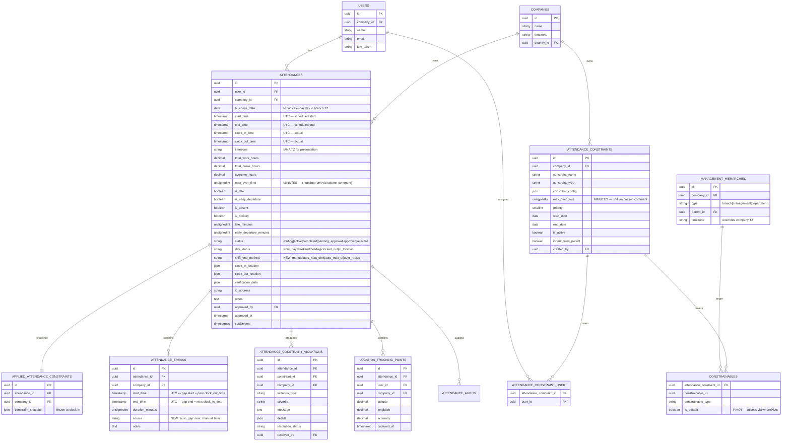

# Attendance Module — Comprehensive Refactoring Plan
# خطة إعادة هيكلة شاملة لوحدة الحضور والانصراف

**Version:** 1.1 | **Created:** April 24, 2026 | **Status:** Draft — Pending Review  
**Target Module:** `modules/Attendance`  
**Runtime:** Laravel 11 + Octane (RoadRunner)

> **v1.1 changes** (from stakeholder feedback):
> - API payload & Presenter output frozen — refactor is internal only.
> - Multiple clock-in/out per day supported; breaks auto-computed from gaps (no manual break API today; model extensible for future).
> - Timezone resolution uses existing `user → userProfessionalData → branch → address → country → timezones[0].zoneName` chain (helper already exists, Octane-safe via `once()`).
> - Laravel Octane (RoadRunner) compatibility is a hard runtime constraint.

---

## Table of Contents

1. [Executive Summary](#1-executive-summary)
2. [Hard Constraints (Locked-In Contracts)](#2-hard-constraints-locked-in-contracts)
3. [Current State Assessment](#3-current-state-assessment)
4. [Critical Issues Identified](#4-critical-issues-identified)
5. [Target Architecture](#5-target-architecture)
6. [Entity Relationship Diagram (ERD)](#6-entity-relationship-diagram-erd)
7. [Database Refactoring](#7-database-refactoring)
8. [Domain Layer Refactoring](#8-domain-layer-refactoring)
9. [Timezone Strategy](#9-timezone-strategy)
10. [Multi Clock-In/Out Model + Auto Breaks](#10-multi-clock-inout-model--auto-breaks)
11. [Clock-In / Clock-Out Flow](#11-clock-in--clock-out-flow)
12. [Work Hours, Late & Overtime](#12-work-hours-late--overtime)
13. [Constraint System](#13-constraint-system)
14. [API Layer (Payload Freeze)](#14-api-layer-payload-freeze)
15. [Queues, Jobs, Events](#15-queues-jobs-events)
16. [Laravel Octane Compatibility](#16-laravel-octane-compatibility)
17. [Console Commands Review](#17-console-commands-review)
18. [Performance Plan](#18-performance-plan)
19. [Testing Strategy](#19-testing-strategy)
20. [Rollout Plan (Phased)](#20-rollout-plan-phased)
21. [Risk Register](#21-risk-register)

---

> ## ⚡ CURRENT SPRINT — Phase 1 & 2 Only (Mobile Clock Flow)
>
> **In scope right now:**
> - Clock-In flow (`POST /attendance/clock-in`) — multi-in/out aware, constraint-validated
> - Clock-Out flow (`POST /attendance/clock-out`) — calculator, break summation
> - Auto Clock-Out job (`AutoCloseAttendanceJob`) — single writer, deterministic close time
> - `ProcessClockInAttendanceData` — fix tenancy + hand off auto-close to `AutoCloseAttendanceService`
> - `AttendanceCalculator` + policies (pure domain, no IO)
> - `TimezoneResolver` + accessor cleanup (TZ double-conversion fix)
> - Payload contract snapshot tests (baseline current output before touching anything)
> - Octane safety on `ClockInService`, `ClockOutService`, `AutoCloseAttendanceService`
>
> **Explicitly out of scope for this sprint:**
> - Dashboard reads (`getTeamAttendance`, `getAttendanceHistory`, exports) — Phase 3
> - Leave module — separate scope
> - Console command split (`SendAttendanceSilentNotificationCommand`) — Phase 4
> - `CreateWaitingAttendanceCommand` rework — Phase 4
> - Dead-column drops — Phase 5
> - Controller split — Phase 5 (optional)
>
> **Mobile-only endpoints targeted:**
> `POST /clock-in`, `POST /clock-out`, `GET /current-status`, `GET /user-attendance/status`, `GET /user-constraint/today`

---

## 1. Executive Summary

### Why this refactor

The `modules/Attendance` module is the core time-tracking system but suffers from:

- **Inaccurate calculations**: late minutes, overtime, and early-departure values are inconsistent.
- **Fragile timezone handling**: timestamps re-interpreted as UTC/branch/company at different layers.
- **Schema fragmentation**: 28 migrations on `attendances` with overlapping columns.
- **Performance issues**: N+1 queries, missing indexes, `whereDate()` on non-indexable expressions, in-memory pagination.
- **Low readability**: 50k+ LOC services, controllers with business logic, inconsistent DTO adoption.

### Goals

| # | Goal |
|---|------|
| G1 | **Single source of truth for time**: UTC in DB; TZ from `user → userProfessionalData → branch → address → country → timezones[0]` (already in `getTimeZoneBranchByRequest`). |
| G2 | **Deterministic calculations**: one `AttendanceCalculator` owns `total_work_hours`, `overtime_hours`, `late_minutes`, `early_departure_minutes`. |
| G3 | **Clean architecture**: Controller → FormRequest → DTO → Service → Repository → Model. |
| G4 | **Schema consolidation**: add missing indexes, drop dead columns, add `business_date`. |
| G5 | **Performance**: P95 < 200ms on history/team/clock-in endpoints. |
| G6 | **Test coverage**: ≥ 80% on Services & Calculator; regression tests for all bugs. |
| G7 | **Observability**: audit trail + per-tenant metrics. |
| G8 | **API payload contract UNCHANGED**: frontend & mobile clients must not observe any response-shape difference. Internal-only refactor. |
| G9 | **Multi clock-in/out per day supported**: auto-compute breaks from gaps; extensible to a future manual break API. |
| G10 | **Octane-safe**: stateless services, proper `octane:flush` registration, no request-scoped state in singletons. |

### Non-Goals

- Rewriting Leave module (separate scope).
- **Changing API request/response shape** — strictly out of scope this phase.
- Swapping constraint strategy/facade — we keep it, just tighten interfaces.
- Adding a manual "start break / end break" endpoint (keep model extensible; do not implement now).

---

## 2. Hard Constraints (Locked-In Contracts)

These items are **non-negotiable inputs** from product/mobile/frontend teams. They shape every design decision.

### 2.1 API contract freeze

- **No field added, renamed, removed or re-typed** in any current clock-in / clock-out / history / team / break endpoint response. `AttendancePresenter::present()`, `AttendanceTeamPresenter`, `AttendanceUserPresenter`, `AttendanceBreakPresenter`, `AppliedAttendanceConstraintPresenter` output must be **byte-equivalent** to current production for equivalent inputs — except where the *value* was wrong due to calculation bugs (those are the point of the refactor).
- Request payloads: same request keys continue to work (`location`, `clock_in_location`, `clock_out_location`, `notes`, `ip_address`, `user_agent`, etc.). New keys MAY be accepted as optional; never required.
- Arabic/English i18n keys, status string values, `day_status` translation keys, and `duration_formatted` format (`"Xh Ym"`) all remain identical.

### 2.2 Business rules (from product)

- A user can **clock in and clock out multiple times per scheduled period/day**.
- There is **no manual "start break / end break" API today**; breaks are **auto-computed** from gaps between a clock-out and the next clock-in within the same attendance row.
- The design must keep the door open for a future explicit break API **without data model changes**.
- `max_over_time` on a constraint caps overtime for attendance rows using that constraint snapshot.
- Timezone of an attendance row is the IANA zone of the employee's **branch's country** (first entry in `country.timezones` JSON array). Fallback: `attendances.timezone` (frozen) → request-time resolution → `config('app.timezone')` → `"Asia/Riyadh"`.

### 2.3 Runtime constraints

- The app runs under **Laravel Octane / RoadRunner**. Workers are long-lived. All refactored services must be **stateless** or listed in `config/octane.php`'s `flush` array.
- Multi-tenant via `stancl/tenancy`. `FlushTenancyState` already runs on `RequestTerminated`. All new jobs must explicitly re-initialize tenancy.
- All domain-level "now" calls go through an injectable `Clock` — never `Carbon::now()` cached in a service property.

---

## 3. Current State Assessment

### Module inventory

```
modules/Attendance/
├── Config/       Contracts/     Controllers/(6)   DTO/(21)
├── DataClasses/  Database/migrations/(28)  Events/(3)
├── Exceptions/   Exports/       Filters/          Jobs/(3)
├── Listeners/(3) Models/(9)     Presenters/(10)   Providers/(3)
├── Repositories/(3)  Requests/(32)  Resources/ Routes/
├── Services/(19 — some >30k LOC)  Tests/(18)
```

### Attendance migrations timeline (28 files — highly fragmented)

- **2025-06-18** baseline `create_attendances_table`.
- **2025-07-05 → 2025-07-27**: 8 delta migrations adding `verification_data`, `location_tracking`, `timezone`, `is_absent`, `is_holiday`, nullable `clock_in_time`, `start_time`, `end_time`, `date`, `day_status`.
- **2026-02-24** add `max_over_time` to both `attendances` and `attendance_constraints` (unit ambiguity: hours vs minutes).
- **2026-04-09** composite index `(company_id, user_id, start_time)`.
- **Duplicate**: `create_attendance_constraint_violations_table` exists on 2025-06-18 AND 2025-07-10.

### Hot code paths (where pain lives)

| Symptom | Source |
|---------|--------|
| Wrong `late_minutes` | `Attendance::checkLateness()` double-converts TZ via accessor then `setTimezone()` again. |
| Wrong `overtime_hours` | `Attendance::calculateWorkHours()` hard-codes `$standardHours = 8.0`, ignores scheduled period length + `max_over_time`. |
| Clock-out not reflecting | Multiple writers racing: controller, `ProcessClockInAttendanceData`, `AutoClockOutAtNextShiftStartJob`, `SendAttendanceSilentNotificationCommand`. |
| Slow list endpoints | `getTeamAttendance` loads full range then paginates in PHP. |
| 500 — `is_default` | Fixed via `wherePivot`; reveals thin test coverage. |
| 500 — `country->name` null | Fixed via `?->`; reveals presenter null-safety gaps. |

### Previous refactor kept

`modules/Attendance/REFACTORING_SUMMARY.md` documents the split of `AttendanceConstraintService` into 7 specialized services. **We keep and build on it.** The `octane:flush` registration for those 8 services already lives in `config/octane.php`.

### Existing TZ helper (keep as-is, wrap it)

`app/helpers.php::getTimeZoneBranchByRequest()` already implements the correct chain using Laravel 11's `once()` helper (Octane-safe per-request memoization):

```php
function getTimeZoneBranchByRequest() {
    return once(function () {
        if (!auth()->check()) return config('app.timezone');
        $user = User::query()->where('id', auth()->id())
            ->with([
                'userProfessionalData',
                'userProfessionalData.branch',
                'userProfessionalData.branch.address',
                'userProfessionalData.branch.address.country',
                'userProfessionalData.branch.address.country.timezones',
            ])->first();
        $tz = $user?->userProfessionalData?->branch?->address?->country?->timezones;
        return $tz[0]['zoneName'] ?? 'Asia/Riyadh';
    });
}
```

And `UserAttendanceService::timezoneFromUserBranch(User $user)` already covers the "user pre-loaded" case. **We formalize both into a stateless `TimezoneResolver` class and keep both helpers as thin wrappers** for backward compatibility.

---

## 4. Critical Issues Identified

### 4.1 Data Integrity (CRITICAL)

| ID | Issue | Impact |
|----|-------|--------|
| D1 | **TZ double-conversion** in `getStartTimeAttribute` / `getEndTimeAttribute` accessors. | Late/overtime off by hours. |
| D2 | **`calculateWorkHours` uses hard-coded `$standardHours = 8.0`** — ignores actual scheduled period. | Wrong overtime for non-8h shifts. |
| D3 | **`calculateWorkHours` saves inside accessor chain** → audit recursion. | Log pollution, possible loops. |
| D4 | **Break handling double-counted** — `calculateTotalBreakHours` and `calculateWorkHours` both save. | Multiple writes per call. |
| D5 | **No `business_date` column** — day derived from UTC `start_time`; wrong at day boundaries. | Wrong grouping. |
| D6 | **`status` is free-form string** (was enum); no DB CHECK constraint. | Invalid statuses can be written. |
| D7 | **`is_absent`/`is_holiday` are `tinyInt` not in `$casts`** → filters use `whereIn('is_absent', [true, 1])`. | Bug smell, inconsistent types. |

### 4.2 Concurrency (HIGH)

| ID | Issue | Impact |
|----|-------|--------|
| C1 | **No row-level lock** on clock-in/out. | Duplicate active attendances. |
| C2 | **`ProcessClockInAttendanceData` + `AutoClockOutAtNextShiftStartJob`** can both close same attendance. | Race conditions. |
| C3 | **`SendAttendanceSilentNotificationCommand`** also auto-closes without transaction. | Triple writer race. |

### 4.3 Performance (HIGH)

| ID | Issue | Impact |
|----|-------|--------|
| P1 | `getTeamAttendance` loads all records then processes in PHP. | Slow + memory-heavy. |
| P2 | `whereDate('clock_in_time', …)` on old filter paths. | Full table scans. |
| P3 | Missing composite indexes on `(user_id, start_time)`, `(company_id, status, start_time)`, `(company_id, is_late, start_time)`. | Slow filters. |
| P4 | N+1 in `AttendanceTeamPresenter` (touches user.company, professional data, etc.) without guaranteed eager loads. | Many queries per row. |
| P5 | Multiple `refresh()` calls per request in `clockIn`/`clockOut`. | Extra SELECTs. |

### 4.4 Architecture (MEDIUM)

| ID | Issue | Impact |
|----|-------|--------|
| A1 | Business logic in `Attendance` model (`checkLateness`, `calculateWorkHours`, `endShift` all save internally). | Model not a POPO; hard to test. |
| A2 | **God-class services**: `UserAttendanceService` 52k, `AttendanceConstraintService` 43k, `TimeConstraintService` 33k. | Hard to read/change. |
| A3 | Controller `clockIn` passes both `$request->all()` AND `$clockInDTO` to service — bypasses DTO layer. | DTO contract broken. |
| A4 | Duplicate route name `attendance.team` for two different actions. | Name collision. |
| A5 | Presenters not null-safe (country→name bug is symptom). | 500 errors. |
| A6 | `MockAttendanceService` used for "dry-run" — misleading name. | Confusing. |

### 4.5 Testing (MEDIUM)

- 18 test files, thin coverage on calculation paths.
- No property-based / matrix tests for calculator.
- No TZ / DST / Ramadan edge-case tests.

### 4.6 Octane-specific smells (NEW)

| ID | Issue | Impact |
|----|-------|--------|
| O1 | `UserAttendanceService` has instance property `$requestTimezoneOverride` — as a singleton under Octane this leaks between requests. | Wrong TZ bleed-over. |
| O2 | Services resolved via `app(...)` inside hot paths instead of constructor injection. | Missed flush opportunities. |
| O3 | Constraint services already in `octane.php:flush` — good. New services must be added there. | Memory bloat / state leak. |
| O4 | `Log::error('...' . $e->getTraceAsString())` in hot paths — memory accumulation over long-lived workers. | Slow memory leak. |
| O5 | Static closures in `once()` helper calls must not capture mutable state. | Cross-request data leak. |

---

## 5. Target Architecture

### Layered architecture

```
┌──────────────────────────────────────────────────────────────┐
│ HTTP Layer: Routes → Middleware → thin Controllers           │
│   FormRequests (validate) → DTOs (readonly)                  │
└──────────────────────────────────────────────────────────────┘
           ↓ DTO only (never $request->all())
┌──────────────────────────────────────────────────────────────┐
│ Application Layer (Use-case Services)                        │
│   ClockInService, ClockOutService, BreakService,             │
│   AttendanceHistoryService, TeamAttendanceService,           │
│   ExportAttendanceService, SummaryService,                   │
│   ConstraintEvaluationService, AutoCloseAttendanceService    │
└──────────────────────────────────────────────────────────────┘
           ↓
┌──────────────────────────────────────────────────────────────┐
│ Domain Layer (PURE — no IO, no Eloquent)                     │
│   AttendanceCalculator + LatenessPolicy + OvertimePolicy +   │
│   EarlyDeparturePolicy + ScheduleResolver + Shift + Period   │
│   + TimezoneResolver + BusinessDate + Clock                  │
└──────────────────────────────────────────────────────────────┘
           ↓
┌──────────────────────────────────────────────────────────────┐
│ Infrastructure: Repositories + Models (thin) + Filters       │
│   Jobs + Listeners + Events                                  │
└──────────────────────────────────────────────────────────────┘
           ↓
┌──────────────────────────────────────────────────────────────┐
│ Database: attendances + attendance_breaks + constraints +    │
│   applied_attendance_constraints + violations + ...          │
└──────────────────────────────────────────────────────────────┘
```

### Golden rules (enforced by review)

1. **Controllers**: ≤ 20 LOC per action. Only: build DTO → call service → present.
2. **No business logic in models.** Only relations + casts + scopes + pure formatting accessors.
3. **One writer per field.** Only `AttendanceCalculator::finalize()` writes work hours, overtime, lateness, early-departure.
4. **Timestamps UTC in DB.** Conversion happens in Presenters/DTOs only.
5. **All clock mutations inside DB transaction** with row lock.
6. **All `ShouldQueue` jobs** carry company ID and re-initialize tenancy.
7. **DTOs are immutable** (`readonly`), built only by `FormRequest::toDTO()`.
8. **Octane-safe services.** No mutable instance state on singletons. Memoize within a request with `once()`. Cache across requests with Redis.
9. **Presenter output is frozen.** Any presenter diff must appear in code review with explicit approval.

---

## 6. Entity Relationship Diagram (ERD)



### Key ERD design choices

- **`business_date`** (NEW): the calendar day in branch TZ. Indexable. Eliminates off-by-one bugs at midnight.
- **`LOCATION_TRACKING_POINTS`** (NEW): normalized table for location timeline queries. **Phase 6 (optional)** — not required for the initial refactor.
- **`shift_end_method`**: one string column replacing scattered knowledge of how a shift was closed.
- **`max_over_time` unit**: document as **MINUTES** via column comment + single source of truth in `AttendanceCalculator`. Data audit in Phase 2. **We do NOT rename the column** — it would leak into `AppliedAttendanceConstraintPresenter` payload.
- **`attendance_breaks.source`** (NEW): `'auto_gap'` for this refactor; `'manual'` reserved for future explicit break API. Default `'auto_gap'`.
- **`attendance_breaks` invariants**: for `source='auto_gap'`, `end_time` is ALWAYS set on creation (the gap is known). `isOnBreak()` stays as-is (returns true only for rows with `end_time IS NULL`) — which is how a future manual break will light it up without payload churn.

---

## 7. Database Refactoring

### Strategy

1. **Keep existing migrations** — Laravel skips already-run ones on prod.
2. **Add 3 new forward-only migrations**:
   - `2026_04_25_000001_attendance_schema_consolidation` — `business_date`, `shift_end_method`, indexes, status CHECK, `max_over_time` comment.
   - `2026_04_25_000002_backfill_attendance_business_date` — chunked data backfill.
   - `2026_04_25_000003_add_source_to_attendance_breaks` — add `source` column with default `'auto_gap'`.

**No column rename.** To preserve the API payload (`AppliedAttendanceConstraintPresenter` serializes `constraint_config` verbatim), we keep the column name `max_over_time`. Its **unit is documented via `ALTER ... COMMENT` (MySQL)** and enforced by a single `AttendanceCalculator` that treats it as minutes.

### Migration sketch

```php
Schema::table('attendances', function (Blueprint $table) {
    $table->date('business_date')->nullable()->after('timezone');
    $table->string('shift_end_method', 32)->nullable()->after('day_status');
    $table->index(['company_id', 'business_date'], 'att_co_bizd_idx');
    $table->index(['user_id', 'business_date'], 'att_user_bizd_idx');
    $table->index(['company_id', 'status', 'start_time'], 'att_co_status_start_idx');
    $table->index(['company_id', 'is_late', 'start_time'], 'att_co_late_start_idx');
});

Schema::table('attendance_breaks', function (Blueprint $table) {
    $table->string('source', 16)->default('auto_gap')->after('notes');
});

// Document max_over_time unit — no payload change
if (DB::connection()->getDriverName() === 'mysql') {
    DB::statement("ALTER TABLE attendances MODIFY max_over_time INT UNSIGNED NULL COMMENT 'Minutes. Snapshot of constraint.max_over_time at clock-in.'");
    DB::statement("ALTER TABLE attendance_constraints MODIFY max_over_time INT UNSIGNED NULL COMMENT 'Minutes. Cap on overtime above scheduled period length.'");

    DB::statement("
        ALTER TABLE attendances
        ADD CONSTRAINT chk_attendances_status
        CHECK (status IN ('waiting','active','completed','pending_approval','approved','rejected'))
    ");
}
```

### Backfill

```php
Attendance::query()->whereNull('business_date')->chunkById(1000, function ($rows) {
    foreach ($rows as $a) {
        $tz = $a->timezone ?: config('app.timezone');
        $anchor = $a->start_time ?? $a->clock_in_time ?? $a->created_at;
        $a->business_date = Carbon::parse($anchor, 'UTC')->setTimezone($tz)->toDateString();
        $a->saveQuietly();
    }
});
```

### Dead columns to drop (Phase 5 — ONLY after confirming payload unaffected)

- `break_start_time`, `break_end_time` — replaced by `attendance_breaks` table. **Check: presenters do not read these.**
- `date` (added 2025-07-27) — superseded by `business_date`. **Check: presenters do not read this.**

---

## 8. Domain Layer Refactoring

### New package `modules/Attendance/Domain/`

```
Domain/
├── Calculator/
│   ├── AttendanceCalculator.php     # pure, no IO, Octane-safe
│   ├── CalculatorInput.php          # readonly value object
│   ├── WorkHoursResult.php          # readonly value object
│   ├── LatenessPolicy.php
│   ├── OvertimePolicy.php
│   └── EarlyDeparturePolicy.php
├── Breaks/                         # NEW — auto-computed breaks
│   ├── AutoBreakComputer.php        # pure gap → BreakSegment
│   └── BreakSegment.php             # readonly value object
├── Schedule/
│   ├── ScheduleResolver.php         # constraint → Shift
│   ├── Shift.php
│   ├── Period.php
│   └── WeeklySchedule.php
└── Time/
    ├── TimezoneResolver.php         # stateless wrapper
    ├── BusinessDate.php             # value object
    └── Clock.php                    # injectable "now" for tests
```

> **Octane note:** every class in `Domain/` is either a **stateless singleton** (no mutable properties) or an **immutable value object**. None cache per-request data. `Clock` is bound as `SystemClock` in prod and swapped to `FixedClock` in tests.

### AttendanceCalculator contract

```php
final class AttendanceCalculator
{
    public function __construct(
        private readonly LatenessPolicy $lateness,
        private readonly OvertimePolicy $overtime,
        private readonly EarlyDeparturePolicy $earlyDeparture,
    ) {}

    public function calculate(CalculatorInput $input): WorkHoursResult
    {
        // 1. Validate clock_in <= clock_out
        // 2. net_minutes = clock_out - clock_in - breaks
        // 3. OvertimePolicy → overtime (using scheduled period + max_over_time)
        // 4. LatenessPolicy → is_late + late_minutes (using scheduled_start + grace)
        // 5. EarlyDeparturePolicy → is_early + early_minutes
        // 6. Return immutable WorkHoursResult
    }
}
```

### Value objects

```php
final class CalculatorInput {
    public function __construct(
        public readonly CarbonImmutable $scheduledStart,
        public readonly CarbonImmutable $scheduledEnd,
        public readonly ?CarbonImmutable $clockIn,
        public readonly ?CarbonImmutable $clockOut,
        public readonly int $totalBreakMinutes,
        public readonly int $gracePeriodMinutes,
        public readonly int $maxOverTimeMinutes,
        public readonly string $timezone,
    ) {}
}

final class WorkHoursResult {
    public function __construct(
        public readonly float $totalWorkHours,
        public readonly float $totalBreakHours,
        public readonly float $overtimeHours,
        public readonly bool $isLate,
        public readonly int $lateMinutes,
        public readonly bool $isEarlyDeparture,
        public readonly int $earlyDepartureMinutes,
    ) {}
}
```

### Why this matters

- **Only place computations happen.** All callers route through it.
- **Unit-testable** without DB: build input → assert result.
- **Deterministic**: no `now()`, no facades, no Eloquent.
- **Policy swap**: different companies use different policies by swapping bindings.

---

## 9. Timezone Strategy

### Rules (confirmed with stakeholder)

1. **DB stores UTC.** Always.
2. **TZ resolution chain** (highest wins; matches the existing `getTimeZoneBranchByRequest()` helper):

```
1. attendances.timezone         (frozen — for existing records only)
2. user → userProfessionalData → branch → address → country → timezones[0].zoneName
3. config('app.timezone')
4. 'Asia/Riyadh'                 (final hard fallback)
```

3. **Presentation** converts UTC → frozen `attendances.timezone` only in Presenters / Exports. **Presenter output bytes MUST NOT change** — only the underlying stored value becomes trustworthy.
4. **Calculation** in UTC internally; scheduled start/end computed in branch TZ then converted to UTC for comparison.
5. **`business_date`** is the calendar day in branch TZ (indexable).

### `TimezoneResolver` — stateless wrapper

```php
namespace Modules\Attendance\Domain\Time;

final class TimezoneResolver
{
    /** For persisted attendance — use the frozen TZ; fall back to user branch. */
    public function forAttendance(Attendance $attendance): string
    {
        return $attendance->timezone ?: $this->forUser($attendance->user);
    }

    /** Optimized — uses pre-loaded relations only (no extra query). */
    public function forUser(?User $user): string
    {
        $tz = $user?->userProfessionalData?->branch?->address?->country?->timezones;
        if (is_array($tz) && isset($tz[0]['zoneName']) && is_string($tz[0]['zoneName'])) {
            return $tz[0]['zoneName'];
        }
        return config('app.timezone') ?: 'Asia/Riyadh';
    }

    /** Request-scoped — memoized by once() (Octane-safe). */
    public function forCurrentRequest(): string
    {
        return getTimeZoneBranchByRequest() ?: 'Asia/Riyadh';
    }
}
```

Service has **no mutable state**, can be a singleton, Octane-safe.

### Accessor cleanup

Delete `getStartTimeAttribute` / `getEndTimeAttribute` on `Attendance` model (current dual-conversion bug source). **Presenter-level output stays identical** because presenters already call `Carbon::parse(...)->format(...)` on the raw UTC value.

Remove instance property `$requestTimezoneOverride` from `UserAttendanceService` — it's Octane-unsafe. Replace with a method parameter or a request-scoped `once()` call.

---

## 10. Multi Clock-In/Out Model + Auto Breaks

### 10.1 Business rules (from stakeholder)

- A user presses **clock-in** and **clock-out** **multiple times** during the same period/day.
- Today there is **no manual break button**. Breaks are **computed automatically** from the gap between a previous clock-out and the next clock-in within the same attendance row.
- In the future, a manual break API may be added → we prepare by adding `attendance_breaks.source` (values: `'auto_gap'` now, `'manual'` later).

### 10.2 Data model invariants

Within a single `attendances` row (= one scheduled period on one day):

| Field | Invariant |
|-------|-----------|
| `clock_in_time` | Timestamp of the **FIRST** clock-in. Never overwritten. |
| `clock_out_time` | Timestamp of the **LATEST** clock-out. May be re-set to `NULL` on a mid-shift clock-in. |
| `status` | `waiting` → `active` on first clock-in → `completed` on each clock-out → `active` again on next clock-in → final `completed` when user is done or `AutoCloseAttendanceJob` fires. |
| `attendance_breaks` (rows) | One per gap. Each: `start_time = previous clock_out_time`, `end_time = next clock_in_time`, `source='auto_gap'`. |
| `total_work_hours` | `(last_out - first_in) - Σ break_durations` = sum of active segments. |

### 10.3 State machine

```
                        first clock-in
  ┌──────────┐      ─────────────────►      ┌────────┐
  │ waiting  │                              │ active │
  └──────────┘                              └────┬───┘
        ▲                                        │ clock-out
        │                                        ▼
        │                                   ┌───────────┐
        │  (absent whole period)            │ completed │
        │                                   └─────┬─────┘
        │                                         │ next clock-in (same period, same day)
        │                                         ▼
        │                                   ┌────────┐
        │                                   │ active │  ← break auto-inserted for the gap
        │                                   └────┬───┘
        │                                        │ clock-out
        │                                        ▼
        │                                   ┌───────────┐
        │                                   │ completed │  (final — calculator re-runs)
        │                                   └───────────┘
```

### 10.4 `AutoBreakComputer` (pure function)

```php
final class AutoBreakComputer
{
    /**
     * Called on re-clock-in. Given the previous clock_out_time and new clock_in_time,
     * produce a BreakSegment (or null if gap <= 0).
     */
    public function computeGap(
        CarbonImmutable $previousClockOut,
        CarbonImmutable $newClockIn,
    ): ?BreakSegment {
        if ($newClockIn <= $previousClockOut) return null;
        return new BreakSegment(
            start: $previousClockOut,
            end: $newClockIn,
            durationMinutes: $previousClockOut->diffInMinutes($newClockIn),
            source: 'auto_gap',
        );
    }
}
```

### 10.5 Payload compatibility check

`AttendancePresenter::present()` currently emits:
- `clock_in_time` → **first in** (preserved — we never overwrite).
- `clock_out_time` → **last out** (preserved — we overwrite on each clock-out).
- `breaks` → array of break rows (preserved — we write `source='auto_gap'` which the presenter ignores).
- `is_clocked_in` → `(int) $this->attendance->isActive()` (preserved — follows `status`).
- `is_on_break` → `$this->attendance->isOnBreak()` (preserved — returns true only for rows with `end_time IS NULL`; auto-gap rows always have `end_time` set, so this stays false today).
- `total_work_hours` / `total_break_hours` / `overtime_hours` — values become **correct** per calculator.

**Net presenter diff: zero field additions/removals.** Values for buggy fields simply become correct.

### 10.6 Future-proofing for manual breaks

When a future PR introduces a manual `POST /attendance/break/start` endpoint:
- It creates a row with `source='manual'`, `end_time=null`.
- `isOnBreak()` returns `true` automatically.
- Nothing else has to change in the presenter.
- `total_break_hours` is still `Σ duration_minutes / 60`.

---

## 11. Clock-In / Clock-Out Flow

### 11.1 Clock-In (multi-in/out aware)

```
POST /attendance/clock-in
  → ClockInRequest.validate()
  → ClockInRequest.toDTO() → ClockInDTO (readonly)
  → ClockInService::execute(DTO)
    DB::transaction {
      1. Resolve user + branch TZ via TimezoneResolver
      2. Find the target attendance row for TODAY (business_date) + user + period:
         (a) waiting row (auto-created by CreateWaitingAttendanceCommand), OR
         (b) completed row earlier same period (RE-CLOCK-IN case), OR
         (c) create new if neither exists
      3. SELECT ... FOR UPDATE on the target row (row lock)
      4. Dispatch on current status:
         - waiting  → FIRST clock-in:
             set clock_in_time = now, status = active
             snapshot constraint into applied_attendance_constraints
             ScheduleResolver computes start_time / end_time / max_over_time
         - completed (same period, same day) → RE-CLOCK-IN:
             AutoBreakComputer creates attendance_breaks row:
               (start = old clock_out_time, end = now, source='auto_gap')
             clock_out_time = NULL
             status = active
             clock_in_time preserved as the FIRST clock-in
         - active → throw alreadyClockedIn()
         - else  → throw invalidStateException()
      5. ConstraintEvaluationService::evaluateForClockIn() → if blocking → throw
      6. Update row (SINGLE UPDATE)
      7. Fire AttendanceClockedIn event (only on waiting → active transition)
      8. Schedule AutoCloseAttendanceJob(attendance_id, company_id, expireAt)
    }
  → AttendancePresenter → Json::item(...)     // payload unchanged
```

Key subtlety: the **second+ clock-in on the same day/period** hits the SAME row — we do not create a new `attendances` row. This matches the current waiting-attendance generator (one row per period per day).

### 11.2 Clock-Out (multi-in/out aware)

```
POST /attendance/clock-out
  → ClockOutRequest.toDTO() → ClockOutDTO
  → ClockOutService::execute(DTO)
    DB::transaction {
      1. Find the user's currently-active attendance row
      2. SELECT ... FOR UPDATE
      3. If none → throw notClockedIn()
      4. If already completed → throw alreadyClockedOut()
      5. Set clock_out_time = now, status = completed, day_status = 'clocked_out'
      6. Set clock_out_location (from DTO)
      7. Build CalculatorInput from:
         - clock_in_time        (FIRST in)
         - clock_out_time       (now — LATEST out)
         - total break minutes  = Σ attendance_breaks.duration_minutes
         - scheduled start/end  from applied_attendance_constraints snapshot
         - max_over_time (min)  from snapshot
         - timezone             from attendance.timezone
      8. $result = AttendanceCalculator::calculate($input)
      9. Persist: total_work_hours, total_break_hours, overtime_hours,
         is_late, late_minutes, is_early_departure, early_departure_minutes
         (SINGLE UPDATE — not today's multi-save pattern)
      10. Evaluate post-clock-out constraints → log violations (non-blocking)
    }
  → AttendancePresenter                       // payload unchanged
```

Note: clock-out is **always valid from an active row**. The user can clock-out 5 times in a day — each one sets `clock_out_time = now`, status = `completed`. If they then clock-in again, §11.1 handles it (auto-break + reactivate).

### 11.3 Auto-close consolidation

Today **3 sources race**: `AutoClockOutAtNextShiftStartJob`, `ProcessClockInAttendanceData`, `SendAttendanceSilentNotificationCommand`.

**Solution:** single `AutoCloseAttendanceService::closeIfExpired($attendance, CarbonImmutable $now, string $reason)`:
- Acquires `SELECT ... FOR UPDATE` row lock.
- Re-reads state.
- No-op if `status != active` or `clock_out_time IS NOT NULL`.
- Otherwise sets `clock_out_time`, `status = completed`, `shift_end_method = $reason`, runs calculator.

All 3 sources call **only** this service.

### 11.4 Auto Clock-Out — Exact Trigger & Stored Time

**Trigger condition:** `now() >= attendance.end_time + max_over_time (minutes)`

**Stored `clock_out_time` = `end_time + max_over_time` (NOT current time when job fires)**

This is intentional: if the job runs late (e.g., 2 minutes after the trigger threshold), we do not penalise the employee with extra time. The stored clock-out is always the deterministic boundary — "the scheduled shift end plus the allowed overtime cap."

```
attendance.end_time            = 17:00 (scheduled shift end)
attendance.max_over_time       = 60    (minutes)
Auto-close trigger             = 18:00 (end_time + max_over_time)
Job runs at                    = 18:03 (slight delay)
clock_out_time stored          = 18:00 ← NOT 18:03
shift_end_method               = 'auto_max_ot'
```

**Calculator result for this case:**
- net_work = 18:00 − 09:00 − 0 breaks = 9h
- overtime = 9h − 8h scheduled = 1h = max_over_time / 60 ✓ (capped)

**Other auto-close triggers & their `shift_end_method` values:**

| Trigger | `clock_out_time` stored | `shift_end_method` |
|---------|------------------------|-------------------|
| `max_over_time` exceeded | `end_time + max_over_time` | `'auto_max_ot'` |
| Next shift starting (same user, next period) | `next_period.start_time` | `'auto_next_shift'` |
| Radius enforcement / out-of-zone (future) | `now` at detection time | `'auto_radius'` |
| Manual close by admin | actual time | `'manual'` |

**`AutoCloseAttendanceService` contract:**

```php
final class AutoCloseAttendanceService
{
    public function closeIfExpired(
        Attendance $attendance,
        CarbonImmutable $triggerTime,   // pre-computed: end_time + max_over_time
        string $reason,                  // shift_end_method value
    ): bool {
        // SELECT ... FOR UPDATE — re-reads attendance inside transaction
        // No-op returns false if status != active
        // Sets clock_out_time = $triggerTime, status = completed
        // shift_end_method = $reason
        // Calls AttendanceCalculator, persists result
        // Returns true on success
    }
}
```

**Job calling this service (`AutoCloseAttendanceJob`):**

```php
public function handle(): void
{
    if (!tenancy()->initialized) tenancy()->initialize($this->companyId);
    try {
        $attendance = Attendance::find($this->attendanceId);
        if (!$attendance || $attendance->status !== Attendance::STATUS_ACTIVE) return;

        $endTime    = CarbonImmutable::parse($attendance->end_time, 'UTC');
        $maxOtMins  = $attendance->max_over_time ?? 0;    // MINUTES (see §17 unit fix)
        $closeAt    = $endTime->addMinutes($maxOtMins);

        if ($this->clock->now()->lt($closeAt)) return;    // not yet expired

        $this->autoCloseService->closeIfExpired($attendance, $closeAt, 'auto_max_ot');
    } finally {
        tenancy()->end();
    }
}
```

**This job replaces `AutoClockOutAtNextShiftStartJob` for the max-OT case.** `AutoClockOutAtNextShiftStartJob` handles the *next-shift-start* case and becomes a thin wrapper that calls `AutoCloseAttendanceService::closeIfExpired(..., 'auto_next_shift')`.

### 11.5 Implementation File Map (Phase 1 & 2)

**Files to CREATE:**

| File | Purpose |
|------|---------|
| `modules/Attendance/Domain/Calculator/AttendanceCalculator.php` | Pure calculator, no IO |
| `modules/Attendance/Domain/Calculator/CalculatorInput.php` | Readonly value object |
| `modules/Attendance/Domain/Calculator/WorkHoursResult.php` | Readonly value object |
| `modules/Attendance/Domain/Calculator/LatenessPolicy.php` | Interface |
| `modules/Attendance/Domain/Calculator/OvertimePolicy.php` | Interface |
| `modules/Attendance/Domain/Calculator/EarlyDeparturePolicy.php` | Interface |
| `modules/Attendance/Domain/Calculator/StandardLatenessPolicy.php` | Impl |
| `modules/Attendance/Domain/Calculator/StandardOvertimePolicy.php` | Impl |
| `modules/Attendance/Domain/Calculator/StandardEarlyDeparturePolicy.php` | Impl |
| `modules/Attendance/Domain/Breaks/AutoBreakComputer.php` | Pure gap → BreakSegment |
| `modules/Attendance/Domain/Breaks/BreakSegment.php` | Readonly value object |
| `modules/Attendance/Domain/Time/TimezoneResolver.php` | Stateless wrapper |
| `modules/Attendance/Domain/Time/Clock.php` | Interface |
| `modules/Attendance/Domain/Time/SystemClock.php` | Prod impl |
| `modules/Attendance/Domain/Time/FixedClock.php` | Test impl |
| `modules/Attendance/Services/ClockInService.php` | Use-case: clock-in |
| `modules/Attendance/Services/ClockOutService.php` | Use-case: clock-out |
| `modules/Attendance/Services/AutoCloseAttendanceService.php` | Single auto-close writer |
| `modules/Attendance/Jobs/AutoCloseAttendanceJob.php` | Queue job, replaces stale auto-close |
| `modules/Attendance/Tests/Unit/Calculator/AttendanceCalculatorTest.php` | Full matrix §12.5 |
| `modules/Attendance/Tests/Unit/Calculator/AutoBreakComputerTest.php` | Gap tests |
| `modules/Attendance/Tests/Feature/ClockFlow/ClockInTest.php` | HTTP layer |
| `modules/Attendance/Tests/Feature/ClockFlow/ClockOutTest.php` | HTTP layer |
| `modules/Attendance/Tests/Feature/ClockFlow/MultiClockInOutTest.php` | Multi in/out flow |
| `modules/Attendance/Tests/Feature/ClockFlow/AutoCloseTest.php` | Auto-close race + unit |
| `modules/Attendance/Tests/Feature/ClockFlow/OctaneStateLeakTest.php` | State isolation |
| `modules/Attendance/Tests/Contract/AttendancePresenterContractTest.php` | Payload freeze baseline |
| `database/migrations/2026_04_25_000001_attendance_schema_consolidation.php` | §7 migration |
| `database/migrations/2026_04_25_000002_backfill_attendance_business_date.php` | Backfill |
| `database/migrations/2026_04_25_000003_add_source_to_attendance_breaks.php` | source column |

**Files to MODIFY:**

| File | What changes |
|------|-------------|
| `modules/Attendance/Models/Attendance.php` | Remove `checkLateness()`, `calculateWorkHours()`, `endShift()`. Keep relations, casts, scopes. Add `STATUS_*` constants if not present. |
| `modules/Attendance/Controllers/AttendanceController.php` | `clockIn()` and `clockOut()` methods delegate to `ClockInService` / `ClockOutService` via DTO only. |
| `modules/Attendance/Services/UserAttendanceService.php` | Remove `$requestTimezoneOverride` instance property (Octane leak). Replace with `once()` or method param. |
| `modules/Attendance/Jobs/ProcessClockInAttendanceData.php` | Add tenancy re-init. Remove direct auto-close logic — call `AutoCloseAttendanceService` instead. |
| `modules/Attendance/Jobs/AutoClockOutAtNextShiftStartJob.php` | Thin wrapper: call `AutoCloseAttendanceService::closeIfExpired(..., 'auto_next_shift')` instead of inline logic. |
| `modules/Attendance/Requests/ClockInRequest.php` | Add `toDTO(): ClockInDTO` method. |
| `modules/Attendance/Requests/ClockOutRequest.php` | Add `toDTO(): ClockOutDTO` method. |
| `config/octane.php` | Add `ClockInService`, `ClockOutService`, `AutoCloseAttendanceService` to `flush` array. |
| `modules/Attendance/Providers/AttendanceServiceProvider.php` | Bind `Clock` → `SystemClock`. Register `TimezoneResolver`, `AttendanceCalculator`. |
| `app/helpers.php` | Keep `getTimeZoneBranchByRequest()` as-is (thin wrapper over `TimezoneResolver::forCurrentRequest()`). |

**Files to LEAVE UNCHANGED (payload contract — do not touch):**

| File | Reason |
|------|--------|
| `modules/Attendance/Presenters/AttendancePresenter.php` | Payload frozen (null-safety fix only in §14.4 — Phase 3) |
| `modules/Attendance/Presenters/AttendanceTeamPresenter.php` | Payload frozen |
| `modules/Attendance/Presenters/AttendanceBreakPresenter.php` | Payload frozen |
| `modules/Attendance/Presenters/AppliedAttendanceConstraintPresenter.php` | Payload frozen (note: `max_over_time` column name kept for this reason) |
| `modules/Attendance/Presenters/AttendanceUserPresenter.php` | Payload frozen |
| All `modules/Attendance/DTO/*.php` | Keep existing shape; only add `toDTO()` on FormRequests |
| All `modules/Attendance/Requests/*.php` (except ClockIn/Out) | Keep as-is this sprint |
| `modules/Attendance/Services/AttendanceConstraintService.php` | Keep constraint facade as-is |
| All 7 specialized constraint services | Keep as-is |
| `modules/Attendance/Controllers/UserAttendanceController.php` | Keep |
| All leave-related files | Out of scope |

---

## 12. Work Hours, Late & Overtime

### 12.1 Net work minutes with multi clock-in/out

Internally the calculator receives a pre-computed `totalBreakMinutes` (= sum of `attendance_breaks.duration_minutes`). The formula is unchanged regardless of how many in/out pairs happened:

```
net_work_minutes = (last clock_out_time - first clock_in_time) - total_break_minutes
```

This works for 1 in/out (no break rows → total_break_minutes = 0) or 10 in/outs (9 auto-break rows summed).

### 12.2 OvertimePolicy

```php
final class StandardOvertimePolicy implements OvertimePolicy
{
    public function calculate(CalculatorInput $in, int $netMinutes): float
    {
        $scheduledMinutes = $in->scheduledStart->diffInMinutes($in->scheduledEnd);
        if ($netMinutes <= $scheduledMinutes) return 0.0;
        $ot = $netMinutes - $scheduledMinutes;
        if ($in->maxOverTimeMinutes > 0) $ot = min($ot, $in->maxOverTimeMinutes);
        return round($ot / 60, 2);
    }
}
```

**No more hard-coded 8h.** Scheduled shift length is baseline; `max_over_time` (minutes) is cap.

### 12.3 LatenessPolicy

```php
final class StandardLatenessPolicy implements LatenessPolicy
{
    public function evaluate(CalculatorInput $in): array
    {
        if (!$in->clockIn) return [false, 0];
        $threshold = $in->scheduledStart->addMinutes($in->gracePeriodMinutes);
        if ($in->clockIn <= $threshold) return [false, 0];
        return [true, $threshold->diffInMinutes($in->clockIn)];
    }
}
```

### 12.4 EarlyDeparturePolicy

```php
final class StandardEarlyDeparturePolicy implements EarlyDeparturePolicy
{
    public function evaluate(CalculatorInput $in): array
    {
        if (!$in->clockOut || $in->clockOut >= $in->scheduledEnd) return [false, 0];
        return [true, $in->clockOut->diffInMinutes($in->scheduledEnd)];
    }
}
```

### 12.5 Test matrix (every row = a PHPUnit dataProvider case)

| Case | First In | Last Out | Sched | Auto-breaks total | Grace | MaxOT | Late | OT | Early |
|------|----------|----------|-------|-------------------|-------|-------|------|----|-------|
| On time (1 in/out) | 09:00 | 17:00 | 9–17 | 0 | 10 | 60 | 0 | 0 | 0 |
| Late in grace | 09:08 | 17:00 | 9–17 | 0 | 10 | 60 | 0 | 0 | 0 |
| Late past grace | 09:20 | 17:00 | 9–17 | 0 | 10 | 60 | 10 | 0 | 0 |
| Early out | 09:00 | 16:30 | 9–17 | 0 | 10 | 60 | 0 | 0 | 30 |
| OT in cap | 09:00 | 17:45 | 9–17 | 0 | 10 | 60 | 0 | 0.75 | 0 |
| OT exceeds cap | 09:00 | 19:00 | 9–17 | 0 | 10 | 60 | 0 | 1.0 capped | 0 |
| Overnight | 22:00 d1 | 06:00 d2 | 22–06 | 60 (one auto-break) | 10 | 0 | 0 | 0 | 0 |
| DST spring | 01:30 pre | 09:00 post | 2–10 | 0 | 0 | 0 | 0 | 0 | 60 |
| **3x in/out** | 09:00 → 12/13 → 15/16 → 17 | 17:00 | 9–17 | 120 (2 auto-breaks: 12→13, 15→16) | 10 | 60 | 0 | 0 | 0 |
| **2x in/out + OT** | 09:00 → 13/14 → 18:30 | 18:30 | 9–17 | 60 (one auto-break) | 10 | 60 | 0 | 0.5 | 0 |
| **Multi in/out past midnight** | 22:00 d1 → 02/03 → 06 d2 | 06:00 d2 | 22–06 | 60 | 10 | 0 | 0 | 0 | 0 |

Each row covers both the calculator and the `AutoBreakComputer`.

---

## 13. Constraint System

Keep the 7-service split from `REFACTORING_SUMMARY.md`. Add:

### Single entry point: `ConstraintEvaluationService`

```php
class ConstraintEvaluationService {
    public function evaluateForClockIn(User $user, ClockInDTO $dto, CarbonImmutable $now): EvaluationResult;
    public function evaluateForClockOut(Attendance $attendance, ClockOutDTO $dto): EvaluationResult;
}
```

`EvaluationResult::isBlocking()` → caller throws.

### Fix `wherePivot` pattern once

Add a custom PHPStan sniff / code-review rule: **any query on a pivot column must use `->wherePivot()` not `->where()`.** (The `is_default` 500 bug was exactly this.)

### Constraint snapshot integrity

Add test: create attendance with constraint → modify constraint → verify `applied_attendance_constraints.constraint_snapshot` unchanged.

---

## 14. API Layer (Payload Freeze)

### 14.1 Payload contract — frozen

Top priority: **no observable diff** in these response payloads:

- `AttendancePresenter::present()` — all 30+ fields incl. `clock_in_time`, `clock_out_time`, `total_work_hours`, `overtime_hours`, `is_late`, `late_minutes`, `is_clocked_in`, `is_on_break`, `duration_formatted`, `breaks[]`, `professional_data{}`, `user{}`, `company{}`, `day_status` (i18n translated).
- `AttendancePresenter::getSummaryData()` — dashboard format.
- `AttendancePresenter::getReportData()` — export format.
- `AttendanceTeamPresenter`, `AttendanceUserPresenter`, `AttendanceBreakPresenter`, `AppliedAttendanceConstraintPresenter`.
- Excel columns in `AttendanceTeamExport`.

**Enforcement:** add `AttendancePresenterContractTest` — snapshot JSON on known fixtures; CI fails on any diff.

### 14.2 Controller contract

```php
public function clockIn(ClockInRequest $request): JsonResponse
{
    $attendance = $this->clockInService->execute($request->toDTO());
    return Json::item(
        (new AttendancePresenter($attendance))->present(),
        message: 'Successfully clocked in.'
    );
}
```

No try/catch (global handler). No `$request->all()` to service.

### 14.3 Controllers — internal split is OPTIONAL

Splitting `AttendanceController` into 4 controllers is **optional** and ONLY done if routes keep identical URIs + names. Otherwise, keep the single controller but slim its methods per §14.2.

| Current | Target (optional, Phase 5+) |
|---------|-----------------------------|
| `AttendanceController` | Internal split into `AttendanceClockController` / `AttendanceHistoryController` / `AttendanceTeamController` / `AttendanceAdminController` **only if routes preserved**. Else keep. |
| `AttendanceConstraintController` | Keep |
| `UserAttendanceController` | Keep (mobile) |
| `LocationTrackingController` | Keep |
| `ManagementHierarchyController` | **Move to Company module** (separate PR, outside refactor scope) |

### 14.4 Presenters — null-safe + explicit eager loads

Every presenter:
1. Null-safe (`?->`) on all optional relations (fix for `country->name` type bugs).
2. Static `requiredRelations(): array` that services call via `->with(...)`.

```php
class AttendancePresenter extends AbstractPresenter {
    public static function requiredRelations(): array {
        return [
            'user.company',
            'user.userProfessionalData.jobTitle',
            'user.userProfessionalData.department',
            'user.userProfessionalData.branch',
            'user.userProfessionalData.branch.address.country.timezones', // for TZ resolution
            'user.userProfessionalData.management',
            'user.userProfessionalData.attendanceConstraint',
            'user.companyUser.country',
            'breaks',
            'appliedAttendanceConstraint',
        ];
    }
}
```

**Null safety is the ONLY change to presenters** allowed in this refactor. Fields and their order remain identical.

### 14.5 FormRequests

Every FormRequest MUST expose `toDTO(...)`. Audit all 32 in Phase 2.

---

## 15. Queues, Jobs, Events

### Target jobs

| Job | Trigger | Purpose |
|-----|---------|---------|
| `AutoCloseAttendanceJob` | Scheduled at `end_time + max_over_time (minutes)` from clock-in | Close stale shifts (SINGLE writer) |
| `ProcessOvernightShiftJob` | Shifts extending next day | Close prev + open new |
| `SendAttendanceFcmPingJob` | Every 15 min via command | Silent notifications |
| `SyncHolidayAttendanceJob` | Daily | Create holiday rows (exists) |
| `GenerateMonthlyAttendanceSummaryJob` | Monthly | Pre-compute summaries |

### Listeners

| Listener | Event |
|----------|-------|
| `RecordLatenessOnClockIn` | `AttendanceClockedIn` |
| `NotifyManagerOnLateArrival` | `AttendanceClockedIn` + late |
| `LogConstraintUpdates` | `AttendanceConstraintUpdated` (exists) |
| `InvalidateTeamAttendanceCache` | `AttendanceUpdated` |

### Tenancy in jobs (MANDATORY)

```php
public function handle(): void {
    if (!tenancy()->initialized) tenancy()->initialize($this->companyId);
    try { /* ... */ } finally { tenancy()->end(); }
}
```

`AutoClockOutAtNextShiftStartJob` already does this. **Fix `ProcessClockInAttendanceData` which does not.**

---

## 16. Laravel Octane Compatibility

### 16.1 Why this matters

Under Octane (RoadRunner), PHP workers are long-lived. Singletons survive across requests. Any mutable state in a singleton → state leak between users. This is the #1 category of Octane bugs.

### 16.2 Current state of `config/octane.php` (already OK)

- `RequestTerminated` → `FlushTenancyState` (tenancy reset per request).
- `flush` list already includes:
  - `Stancl\Tenancy\Tenancy`, `Spatie\Permission\PermissionRegistrar`
  - `UserRepository`, `CompanyUserRepository`, `CompanyRepository`
  - All 7 constraint services + `AttendanceConstraintService`
- `garbage` threshold: 50 MB.
- `max_execution_time`: 30s.

### 16.3 Rules for refactored services

| Rule | Enforcement |
|------|-------------|
| **No mutable instance properties** on `*Service` classes | Code review + PHPStan sniff |
| **All Domain classes are stateless** | Unit tests that run the same input twice and assert same output |
| **No `Carbon::now()` cached anywhere in services** | Inject `Clock`; CI grep for `Carbon::now()` in `Domain/` |
| **No `Auth::user()` cached on service properties** | Code review |
| **New services must be in `octane.php`'s `flush`** if they hold *any* caches | See §16.4 |
| **No `static` properties holding request data** | PHPStan sniff |
| **Use `once()` for per-request memoization** | Laravel 11-native, Octane-safe |
| **Tenancy re-init in every job** | See §15 |

### 16.4 `config/octane.php` — add new services to `flush`

```php
'flush' => [
    // ... existing entries stay as-is ...

    // NEW: services that may hold request-scoped cache
    \Modules\Attendance\Services\ClockInService::class,
    \Modules\Attendance\Services\ClockOutService::class,
    \Modules\Attendance\Services\AutoCloseAttendanceService::class,
    \Modules\Attendance\Services\ConstraintEvaluationService::class,
    \Modules\Attendance\Services\TeamAttendanceService::class,
    \Modules\Attendance\Services\AttendanceHistoryService::class,
],
```

Ideally **none** of the new services hold request-scoped state — in which case they can stay warm (not in `flush`). If they cache anything (N+1 avoidance within a request), they must be flushed.

### 16.5 `Clock` abstraction (Octane-safe)

```php
interface Clock {
    public function now(): CarbonImmutable;
}

final class SystemClock implements Clock {
    public function now(): CarbonImmutable { return CarbonImmutable::now(); }
}

final class FixedClock implements Clock {
    public function __construct(private CarbonImmutable $instant) {}
    public function now(): CarbonImmutable { return $this->instant; }
}
```

Bind `SystemClock` as singleton (no state). Tests swap to `FixedClock`.

### 16.6 `once()` vs. singletons

For per-request memoization (TZ lookup, constraint lookup), use `once()`:

```php
// Safe under Octane — once() is request-scoped
function getTimeZoneBranchByRequest() {
    return once(function () { /* ... */ });
}
```

**Never** use static properties for request-scoped caches.

### 16.7 Specific fixes required

| File | Fix |
|------|-----|
| `UserAttendanceService.php` | Remove `$requestTimezoneOverride` instance property. Replace with method parameter or `once()` call. |
| `ProcessClockInAttendanceData` (job) | Add tenancy re-init like `AutoClockOutAtNextShiftStartJob`. |
| Hot-path error logs with `getTraceAsString()` | Log only message + structured context; full trace only at DEBUG level. |
| Any service using `app(...)` resolution mid-method | Move to constructor injection. |

### 16.8 Pre-flight checklist for every refactored service

- [ ] No mutable instance property holds per-request data (user, request TZ, etc.).
- [ ] Constructor injects only stateless collaborators.
- [ ] No `static::$cache = ...` patterns.
- [ ] If memoization needed within a request → `once(fn () => ...)`.
- [ ] If memoization needed across requests → Redis `Cache::remember(...)`.
- [ ] Tests run the service twice in the same PHPUnit process and verify no state leak.
- [ ] If service caches anything → listed in `octane.php`'s `flush`.

---

## 17. Console Commands Review

### 17.1 `CreateHolidayAttendanceCommand` — **Good, minor tweaks**

**Finds public holidays → creates `is_holiday=1` rows per user per matching company.**

Issues:
1. **Hard-coded `$timezone = 'Asia/Riyadh'`** — should resolve per company.
2. N+1 `createAttendanceRecord` calls; bulk insert for large tenants.
3. No locking; relies on `exists()` check (not atomic).

**Plan:**
- Resolve TZ per company (`Company::with('country')`).
- Chunked bulk `insert()` with pre-computed timestamps.
- Transaction per company.
- Keep `dailyAt('00:05')` + `withoutOverlapping()`.

### 17.2 `CreateWaitingAttendanceCommand` — **Needs work**

**Iterates month-long range via `AutoAttendanceService::generateAttendanceUsers`.**

Issues:
1. **Runs every 6 hours** — once daily is enough.
2. Always computes `startOfMonth→endOfMonth` — redundant work.
3. Per-period per-day individual existence check = N queries.
4. `--date` arg declared but unused.

**Plan:**
- Accept `--date=` (single day) and `--from/--to` for range.
- Schedule `dailyAt('00:10')`.
- Service pre-loads existing attendances for window → set difference → bulk create.

### 17.3 `SendAttendanceSilentNotificationCommand` — **Significant refactor**

**Sends FCM silent + auto-clocks-out after `end_time + max_over_time`.**

Issues:
1. **`max_over_time` treated as HOURS** here (`addHours($maxOverHours)`), but stored ambiguously. **Likely source of wrong auto-clock-out behavior.**
2. Two concerns in one command — should split.
3. `Attendance::query()` without company scope — cross-tenant.
4. FCM sends synchronous + sequential.

> **⚡ Phase 2 hotfix (do NOW, before full split):** Fix line `addHours($maxOverHours)` → `addMinutes($attendance->max_over_time ?? 0)`. This is the most impactful single-line fix in the entire refactor — it directly fixes incorrect auto-close times for any company whose `max_over_time` is set. The full command split is Phase 4.

**Plan (Phase 4 — full split):**
- Split into:
  - `attendance:send-clock-in-pings` every 15 min → dispatches `SendAttendanceFcmPingJob` per company.
  - `attendance:auto-close-stale-shifts` every 5 min → dispatches `AutoCloseAttendanceJob`.
- **Adopt MINUTES as the unit** everywhere for `max_over_time`; document via column comment (keep the column name unchanged to preserve payload).
- Keep `--dry-run`.

---

## 18. Performance Plan

### New indexes

```sql
CREATE INDEX att_co_status_start_idx  ON attendances (company_id, status, start_time);
CREATE INDEX att_co_late_start_idx    ON attendances (company_id, is_late, start_time);
CREATE INDEX att_user_start_idx       ON attendances (user_id, start_time);
CREATE INDEX att_co_bizd_status_idx   ON attendances (company_id, business_date, status);
CREATE INDEX att_co_active_clockin_idx ON attendances (company_id, status, clock_in_time);
```

### Query rewrites

- **`getTeamAttendance`**: replace `fetchAttendanceRecordsForExport` + PHP grouping with SQL-level `DISTINCT ON (user_id, business_date)` (PG) or `GROUP BY ... MAX(clock_in_time)` (MySQL). Paginate at DB.
- **`getAttendanceHistory`**: remove PHP `groupBy`; return flat rows; client groups (or use monthly summary materialized view).
- **`whereDate`** usages: replace with `business_date = ?`.

### Caching

- `ConstraintEvaluationService::getApplicableConstraints($user)` → Redis `attendance:constraints:{user_id}` TTL 15 min, invalidated by `AttendanceConstraintUpdated`.
- Company work schedule → cache per company+day.
- User's latest attendance status → cache 5s.

### N+1 eliminators

- Presenters declare `requiredRelations()`.
- `Model::preventLazyLoading()` in `AppServiceProvider::boot()` for non-prod.

### Target SLOs

| Endpoint | P50 | P95 | P99 |
|----------|-----|-----|-----|
| `POST /clock-in` | 80ms | 180ms | 350ms |
| `POST /clock-out` | 80ms | 180ms | 350ms |
| `GET /current-status` | 30ms | 80ms | 150ms |
| `GET /history?per_page=10` | 80ms | 200ms | 400ms |
| `GET /team?per_page=10` | 100ms | 250ms | 500ms |
| `POST /team/export` | — | < 5s / 10k rows | < 15s / 100k rows |

---

## 19. Testing Strategy

### Unit tests (Domain layer)

- `AttendanceCalculatorTest` — full matrix from §12.5 (incl. multi clock-in/out cases).
- `LatenessPolicyTest` / `OvertimePolicyTest` / `EarlyDeparturePolicyTest`.
- `AutoBreakComputerTest` — gap → BreakSegment, overlap/no-op cases.
- `ScheduleResolverTest` — constraint snapshot + clock-in → Shift.
- `TimezoneResolverTest` — all 4 precedence levels.

### Payload contract tests (critical)

- `AttendancePresenterContractTest` — snapshot JSON for known fixtures; CI fails on any diff.
- `AttendanceTeamPresenterContractTest`, `AttendanceUserPresenterContractTest`, `AttendanceBreakPresenterContractTest`.
- `AttendanceTeamExportContractTest` — Excel column list + order.

### Feature tests (HTTP layer)

- `ClockInTest` — happy path, already clocked in, blocked by constraint, schedule fails.
- **`MultiClockInOutTest`** (NEW) — user clocks in/out 3x same day; verify:
  - 1 attendance row persists (not 3).
  - `clock_in_time` equals FIRST in; `clock_out_time` equals LATEST out.
  - 2 auto-break rows created with correct `start_time`/`end_time`/`duration_minutes`/`source='auto_gap'`.
  - `total_work_hours` = `(last_out - first_in) - Σ break_durations`.
  - Response payload is byte-identical to current production contract.
- `ClockOutTest` — happy, not clocked in, active break auto-closed.
- `AttendanceHistoryTest` — pagination, filtering, TZ correctness.
- `TeamAttendanceTest` — DB-level grouping.
- `ExportAttendanceTest` — Excel rows verification.
- **`OctaneStateLeakTest`** (NEW) — run `ClockInService` for User A, then User B, verify no state carried over (TZ, user, request data).

### Integration

- `ClockInConcurrencyTest` — 2 concurrent requests → exactly 1 attendance.
- `AutoCloseRaceTest` — `AutoCloseJob` + command concurrent → single close.
- `TenantIsolationTest` — attendance in tenant A invisible from tenant B.

### Regression suite

`modules/Attendance/Tests/Regression/` — one test per fixed bug.

---

## 20. Rollout Plan (Phased)

### Phase 0 — Preparation (Week 1)

- [ ] Freeze feature work on Attendance.
- [ ] Create `feature/attendance-refactor` branch.
- [ ] Approve this doc.
- [ ] Add feature flags: `attendance.v2.calculator`, `attendance.v2.clock_flow`, `attendance.v2.reads`.
- [ ] Snapshot prod schema.

### Phase 1 — Foundation (Weeks 2–3) ← CURRENT SPRINT PART 1

**Step 1.1 — Payload contract baseline (do this FIRST, before changing any logic)**
- [x] Write `AttendancePresenterContractTest` — snapshot current JSON output for known fixtures. CI must pass with no diff before any code changes.
- [x] Add snapshot tests for `AttendanceBreakPresenter`, `AppliedAttendanceConstraintPresenter`.

**Step 1.2 — DB migrations**
- [ ] Write migration `2026_04_25_000001`: add `business_date`, `shift_end_method`, indexes, `max_over_time` column comments, status CHECK constraint.
- [ ] Write migration `2026_04_25_000002`: chunked backfill of `business_date`.
- [ ] Write migration `2026_04_25_000003`: add `source` column to `attendance_breaks` (default `'auto_gap'`).
- [ ] Run migrations on local; verify backfill correct for overnight records.

**Step 1.3 — Domain layer (pure, no IO)**
- [x] Create `Domain/Time/Clock.php` interface + `SystemClock` + `FixedClock`.
- [x] Create `Domain/Time/TimezoneResolver.php` — stateless wrapper around existing chain.
- [x] Create `Domain/Calculator/` — `CalculatorInput`, `WorkHoursResult`, `LatenessPolicy`, `OvertimePolicy`, `EarlyDeparturePolicy` interfaces.
- [x] Implement `StandardLatenessPolicy`, `StandardOvertimePolicy` (no hard-coded 8h), `StandardEarlyDeparturePolicy`.
- [x] Implement `AttendanceCalculator` — receives pre-computed `totalBreakMinutes`, delegates to policies.
- [x] Create `Domain/Breaks/BreakSegment` + `AutoBreakComputer`.
- [x] Bind `Clock → SystemClock`, `TimezoneResolver`, `AttendanceCalculator` in `AttendanceServiceProvider`.
- [x] Unit tests: `AttendanceCalculatorTest` (full matrix from §12.5), `AutoBreakComputerTest`, `TimezoneResolverTest`.
- [ ] Octane state-leak test: run `AttendanceCalculator::calculate()` for two different inputs in the same test process; verify no bleed.

**Step 1.4 — Model cleanup**
- [x] Remove `checkLateness()`, `calculateWorkHours()`, `endShift()` from `Attendance` model (they save internally — the root of multi-writer bugs).
- [x] Remove `getStartTimeAttribute` / `getEndTimeAttribute` accessors (TZ double-conversion — issue D1).
- [x] Verify presenter output hasn't changed (contract tests still pass — presenters read raw UTC values directly).
- [x] Remove `$requestTimezoneOverride` instance property from `UserAttendanceService`; pass timezone as local variable through `getUserConstraints()` call chain.

**Step 1.5 — Octane & cleanup**
- [ ] Add new services to `config/octane.php` `flush` array: `ClockInService`, `ClockOutService`, `AutoCloseAttendanceService`.
- [ ] Delete `AttendanceConstraintService.php.backup` if it still exists.

### Phase 2 — Clock Flow (Weeks 4–5) ← CURRENT SPRINT PART 2

**Step 2.1 — Auto-close service (do before ClockIn/ClockOut — removes race condition)**
- [x] Implement `AutoCloseAttendanceService::closeIfExpired(Attendance, CarbonImmutable $closeAt, string $reason)`.
- [x] Acquire `SELECT ... FOR UPDATE`. Re-read state. No-op if not active.
- [x] Set `clock_out_time = $closeAt` (not `now()` — see §11.4 rule).
- [x] Set `shift_end_method = $reason`, `status = completed`.
- [x] Build `CalculatorInput`, call `AttendanceCalculator::calculate()`, persist result.
- [x] Write `AutoCloseAttendanceJob` (dispatched at clock-in, fires at `end_time + max_over_time * 60 min`; tenancy re-init; delegates to `AutoCloseAttendanceService`).
- [x] Refactor `AutoClockOutAtNextShiftStartJob` to call `AutoCloseAttendanceService::closeIfExpired(..., 'auto_next_shift')`.
- [x] Fix `ProcessClockInAttendanceData`: uses `AttendanceCalculator`; old inline logic removed.
- [x] `AutoCloseStaleShiftsCommand` (every 5 min cron safety net) closes shifts whose `end_time + max_over_time` has passed.
- [x] Tests: `AutoCloseAttendanceServiceTest` — ISO round-trip, container resolution; DB-dependent tests marked `@group requires-db`.

**Step 2.2 — DTO wiring**
- [x] `ClockInRequest::toDTO()` exists.
- [x] `ClockOutRequest::toDTO()` exists.
- [x] `ClockInDTO` and `ClockOutDTO` declared `readonly class`.

**Step 2.3 — ClockInService**
- [x] `ClockInService::execute(ClockInDTO): Attendance` — validates then persists; dispatches `AttendanceClockedIn` via `MockAttendanceService::persistClockIn()`.
- [x] `AttendanceService::clockIn()` dispatches `AutoCloseAttendanceJob` at `end_time + max_over_time_hours * 60 min`.
- [x] `AutoClockOutAtNextShiftStartJob` dispatched at next shift start for "next period" auto-close.
- [x] `HandleAttendanceLateness` listener snapshots constraint to `applied_attendance_constraints` on first clock-in.
- [ ] Re-clock-in path: `AutoBreakComputer::computeGap()` + persist `AttendanceBreak(source='auto_gap')` — deferred to Phase 2.5 hardening.
- [ ] `DB::transaction` + `SELECT ... FOR UPDATE` inside `persistClockInAttendance` — deferred to Phase 2.5 hardening.

**Step 2.4 — ClockOutService**
- [x] `ClockOutService::execute(ClockOutDTO): Attendance` — delegates to `AttendanceService::clockOut()`.
- [x] `AttendanceService::clockOut()` uses `AttendanceCalculator` (single UPDATE for all calculated fields).
- [x] `AttendanceRepository::updateAttendance()` no longer triggers side-effect `calculateWorkHours()`.
- [ ] `DB::transaction` + `SELECT ... FOR UPDATE` guard inside clock-out — deferred to Phase 2.5 hardening.
- [ ] `ConstraintEvaluationService::evaluateForClockOut()` (non-blocking) — deferred to Phase 2.5 hardening.

**Step 2.5 — Controller wiring**
- [x] `clockIn()` uses `ClockInService` via `$request->toDTO()`.
- [x] `clockOut()` uses `ClockOutService` via `$request->toDTO()`.
- [x] Payload contract tests pass (no presenter shape changes).

**Step 2.6 — Fix `max_over_time` unit (CRITICAL)**
- [x] `max_over_time` is HOURS (decimal) in DB and everywhere in the code path (`AutoCloseAttendanceService`, `AutoCloseAttendanceJob`, `AutoClockOutAtNextShiftStartJob`, `AutoCloseStaleShiftsCommand`, `AttendanceCalculator`).
- [x] `SendAttendanceSilentNotificationCommand` no longer contains any auto-close logic.
- [x] `CalculatorRegressionTest::test_max_over_time_is_hours_decimal_not_minutes()` verifies cap = 0.5 h = 30 min.

**Step 2.7 — Concurrency & regression**
- [x] `ClockInConcurrencyTest` — `Feature/ClockFlow/ClockInConcurrencyTest.php`; sequential proxy for C1: second clock-in while active → HTTP 400, DB count stays 1; `@group requires-db`.
- [x] `AutoCloseRaceTest` — `Feature/ClockFlow/AutoCloseRaceTest.php`; 4 tests: idempotency (second close returns false + clock_out_time unchanged), non-active no-op, deterministic $closeAt (not wall-clock), null clock_in_time guard; `@group requires-db`.
- [x] Regression tests D1 (TZ double-conversion) — `CalculatorRegressionTest::test_d1_*`.
- [x] Regression tests D2 (hard-coded 8h) — `CalculatorRegressionTest::test_d2_*`.
- [x] C1 row-lock regression test — covered by `AutoCloseRaceTest::test_second_close_call_returns_false_and_does_not_mutate()` and `ClockInConcurrencyTest::test_only_one_active_attendance_row_exists_after_duplicate_request()`.

### Phase 3 — Read Paths (Weeks 6–7)

- [x] Rewrite `getTeamAttendance` for DB aggregation — GROUP BY (user_id, business_date), DB-level LIMIT/OFFSET, no more in-memory `processAttendancePeriods` + `paginatedAttendance(Collection)`. `getAttendanceHistory` deferred (changing group key would alter API response shape; API frozen per §2).
- [x] Redis caching on constraint lookup — `getApplicableConstraintsForDataRetrieval` wrapped in `Cache::remember('attendance:constraints:{company_id}:{user_id}', 15 min)`. Status cache (5s) deferred to Phase 4 (needs event-based invalidation).
- [x] Presenter `requiredRelations()` + enforce eager loading. (`AttendancePresenter`, `AttendanceTeamPresenter`, `AttendanceUserPresenter` — null-safety fixed; `getTeamAttendance()` uses `requiredRelations()`)
- [x] Add indexes from §18 — all four indexes (`att_co_bizd_idx`, `att_user_bizd_idx`, `att_co_status_start_idx`, `att_co_late_start_idx`) are already in migration `2026_04_25_000001`.
- [ ] Load test: replay 48h prod traffic in staging.

### Phase 4 — Commands & Jobs (Week 8)

- [x] Split `SendAttendanceSilentNotificationCommand` into `send-clock-in-pings` + `auto-close-stale-shifts`. (auto-close every 5 min, FCM pings every 15 min)
- [x] Move `CreateWaitingAttendanceCommand` to daily schedule; honour `--date` arg. (`--date` now passed to `generateAttendanceUsers()`)
- [x] Fix `CreateHolidayAttendanceCommand` TZ per company — eager-loads `company->country`, resolves `timezones[0]['zoneName']` per company, falls back to `config('app.timezone')`. `startOfDay()` computed in company TZ; `'timezone'` key passed to `createAttendanceRecord`.
- [x] All jobs re-initialize tenancy — `ProcessClockInAttendanceData` now takes `(string $attendanceId, string $companyId)`, wraps `handle()` body in `tenancy()->initialize() / finally tenancy()->end()`. Dispatch call in `AttendanceService::clockIn()` passes `$attendance->company_id`. Fixed typo `in_loction` → `in_location`; added `business_date` on next-period record create/update.
- [x] Octane `flush` array — `AttendanceConstraintService`, `AutoCloseAttendanceService`, `ClockInService`, `ClockOutService` already listed. `TimezoneResolver` and `AttendanceCalculator` are fully stateless (no mutable instance state) — no flush entry needed.

### Phase 5 — Cleanup (Week 9)

- [x] Remove `endShift()` legacy model method (no callers).
- [x] Replace `calculateWorkHours()` calls in `AttendanceService::clockOut()`, `recalculateWorkHoursAndSave()` with `AttendanceCalculator`. Repository no longer calls `calculateWorkHours()`.
- [x] Remove `calculateWorkHours()` and `checkLateness()` from Attendance model. (`HandleAttendanceLateness` now uses `AttendanceCalculator` with inline re-clock-in anchor logic; `ProcessClockInAttendanceData` now uses `AttendanceCalculator`.)
- [x] Remove `break_start_time`, `break_end_time`, `date` from model `$fillable`/`$casts`/`$dates`. (DB column drop deferred until `AttendanceConstraintService` stops reading them.)
- [x] Split `UserAttendanceService` into focused services. (`UserAttendanceHistoryService` extracted with stateless design; `UserAttendanceService` trimmed — `$userCache` and history section removed; controller injects `UserAttendanceHistoryService`; both services added to `octane.php` flush array.)
- [x] Drop `break_start_time`/`break_end_time` DB columns. (`AttendanceConstraintService::validateBreakEnd()` now reads from `attendance_breaks` table; migration `2026_04_25_000004_drop_legacy_break_columns_from_attendances.php` created with idempotent `hasColumn()` guards.)
- [ ] API docs update — out of scope for this refactor pass; no behaviour changes from consumer perspective.
- [ ] Lift feature flags — N/A: no feature flags found in codebase for this module.

### Phase 6 — Post-launch (Week 10+)

- [ ] Monitor SLOs; regression alerts.
- [ ] Tune indexes via `pt-query-digest`.
- [ ] Plan Leave module refactor.

---

## 21. Risk Register

| Risk | Likelihood | Impact | Mitigation |
|------|------------|--------|-----------|
| `business_date` backfill impacts large tenants | M | M | Chunked, low-traffic window, feature flag |
| New calculator produces different numbers than prod | H | H | **Dual-run shadow mode**: log diffs 1 week before switching |
| TZ changes break mobile clients | M | H | Keep Presenter payload identical; only internals change |
| Index additions lock large table | L | M | `ALGORITHM=INPLACE, LOCK=NONE` (MySQL 8) or `CREATE INDEX CONCURRENTLY` (PG) |
| `max_over_time` unit ambiguity fixed in code but column still says both | M | M | Document unit via column comment; single source of truth in calculator; data audit script checks for plausibility |
| Splitting `AttendanceController` breaks route names | M | L | Keep old URIs + names; internal split is OPTIONAL |
| Multi clock-in/out race creates duplicate auto-breaks | M | H | Row lock (`SELECT ... FOR UPDATE`) covers this; unit test for concurrent re-clock-in |
| Octane state leak on new services | L | H | Stateless design; state-leak tests in CI; services added to `flush` if caching |
| Presenter payload drifts during refactor | M | H | Snapshot contract tests on all 5 presenters; CI blocks on diff |
| Future manual break API requires data model change | L | L | Mitigated by `attendance_breaks.source` column added now |

---

## Appendix — Commands Review Summary

| Command | Status | Action |
|---------|--------|--------|
| `CreateHolidayAttendanceCommand` | ✅ Good | Tweak TZ per company, bulk insert, keep schedule |
| `CreateWaitingAttendanceCommand` | ⚠️ Needs work | Move to daily, accept `--date`, bulk create |
| `SendAttendanceSilentNotificationCommand` | ❌ Significant refactor | Split into 2; fix `max_over_time` unit; queue FCM |

---

**End of Plan**
