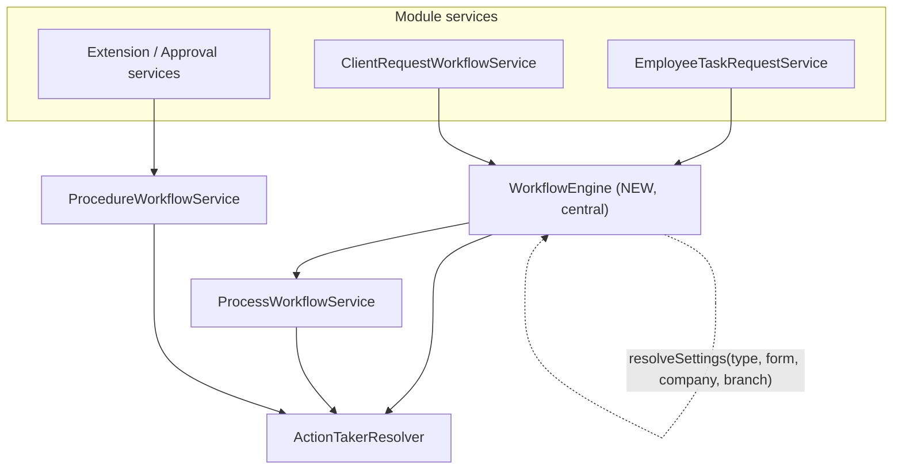

# Workflow Centralization + Bug-Fix Plan (for implementation)

> Audience: an AI/developer implementing the changes (Sonnet).
> Scope chosen: Option B + ClientRequest = fix confirmed bugs AND build one central
> reusable `WorkflowEngine`, then migrate **EmployeeTask** and **ClientRequest** onto it.
> Other modules (price_offer, contract, meeting) become trivial to add afterwards.
>
> Stack: Laravel, multi-tenant (`Stancl\Tenancy`), modular (`modules/<Name>`), PHP 8.1+ enums, strict types.

---

## 00. READ FIRST — Source of truth & how to use the two docs

There are TWO docs in `docs/`:
1. THIS file (`WORKFLOW_CENTRALIZATION_PLAN.md`) — the authoritative plan. Follow it.
2. `PROCEDURE_WORKFLOW_DEEP_GUIDE.md` — background/context ONLY. It is **partly outdated,
   partly aspirational, and contains several factual errors** (see §0A). Do NOT copy code or
   signatures from it. Use it only to understand intent.

ABSOLUTE RULES for the implementing AI:
- The CODE is the only source of truth. Before editing ANY file, OPEN AND READ the current file
  end to end. Do not rely on line numbers in this plan — they are approximate and may drift; locate
  code by method name and content.
- Before relying on any signature, enum value, or "this is already done" claim from the DEEP_GUIDE,
  VERIFY it against the actual class. If they disagree, the code wins.
- Make changes incrementally in the order of §13. After each task: run the build/linter and the
  verification for that task (§14). Do not batch unrelated edits.
- Do NOT rename existing public methods or change existing route/controller contracts unless this
  plan explicitly says so. Other modules and the mobile app depend on them.
- Keep `declare(strict_types=1);`, existing namespaces, and existing code style. Match the file.
- If reality differs from this plan in a way that changes behavior, STOP and surface it in your
  summary rather than guessing.

### Pre-flight: open and read these files before writing code
Workflow core:
- `modules/ProcedureSetting/Services/ProcedureWorkflowService.php`
- `modules/ProcedureSetting/Services/ActionTakerResolver.php`
- `modules/Process/Services/ProcessWorkflowService.php`
- `modules/Process/Models/Process.php` and `modules/Process/Models/ProcessStep.php`
- `modules/Process/Enums/ProcessStatus.php` and `modules/Process/Enums/ProcessStepStatus.php`
- `modules/ProcedureSetting/Models/ProcedureSetting.php`, `ProcedureSettingStep.php`, `WorkFlow.php`
- `modules/ProcedureSetting/Repositories/ProcedureSettingRepository.php` (default/branch workflow queries)
- `modules/Shared/InternalProcessType/Enums/InternalProcessForm.php` (REAL enum + values)
- `modules/ProcedureSetting/Enums/ProcedureSettingType.php`
Consumers:
- `modules/EmployeeTask/Services/EmployeeTaskRequestService.php`
- `modules/EmployeeTask/Services/EmployeeTaskExtensionService.php`
- `modules/EmployeeTask/Services/EmployeeTaskApprovalService.php`
- `modules/ClientRequest/Services/ClientRequestWorkflowService.php`
- `modules/ClientRequest/Controllers/ClientRequestController.php`
- `modules/ProcedureSetting/Controllers/ProcedureSettingController.php`
Notifications:
- `modules/ProcedureSetting/Events/WorkflowStepActivated.php`
- `modules/ProcedureSetting/Listeners/SendWorkflowStepNotification.php`
- `modules/ProcedureSetting/Notifications/WorkflowActionRequired.php`
- `modules/EmployeeTask/Events/EmployeeTaskNotification.php`, `InboxCountsUpdated.php`
Providers (to know where bindings/listeners are registered):
- `modules/ProcedureSetting/Providers/*ServiceProvider.php`
- `modules/EmployeeTask/Providers/*ServiceProvider.php`
- `modules/ClientRequest/Providers/*ServiceProvider.php`

---

## 0A. Problems in `PROCEDURE_WORKFLOW_DEEP_GUIDE.md` (do NOT trust these parts)

The DEEP_GUIDE is useful for concepts (action-taker types, sequence vs parallel, snapshots), but the
following statements in it are WRONG or STALE versus the current code. Treat each as a known trap.

| # | DEEP_GUIDE says | Reality (verified in code) | Impact on implementation |
|---|-----------------|----------------------------|--------------------------|
| G1 | `InternalProcessForm` values are snake_case (`create_task`, `extend_task_time`, ...) and shows an `applicableTo()` method | Real enum at `modules/Shared/InternalProcessType/Enums/InternalProcessForm.php` uses **camelCase** (`createTask`, `extendTaskTime`, `sendForApproval`, ...). Methods are `applicableTypes()`, `forType()`, `labelAr()`, `conditions()`, `toDefinition()`, `values()` — there is NO `applicableTo()` | ALWAYS use `InternalProcessForm::CreateTask->value` (= `createTask`). DB stores camelCase. Never hardcode snake_case |
| G2 | Enum namespace implied under `Modules\ProcedureSetting\Enums` | It lives under `Modules\Shared\InternalProcessType\Enums` | Import the correct namespace |
| G3 | `getApprovalResponsibles($procedureType, $createdByUserId, $context)` (3 params), works correctly | Real signature has a 4th param `?string $formKey`, and its body is BROKEN (BUG-2: grandchild query, null-deref, no company/branch scope) | Do not assume it works; it is being rewritten in Task 3 |
| G4 | "All notifications handled centrally; ClientRequest notifications automatic; no manual changes needed" | Listener real-time path is gated to `processable_type === 'employee_task'`; ClientRequest does NOT fire `WorkflowStepActivated` today; inbox counts are hardcoded `0` (BUG-3) | The central notifier (Task 4) is what actually makes this true. Do not assume it already works |
| G5 | §6 flow calls `WorkflowService.createProcessForEntity()` | No such class/method exists | Real entry points: `ProcessWorkflowService::createProcessesFromSettings()` and the new `WorkflowEngine` |
| G6 | §7 `rejectStep` works (checks pending → 422 if not) | `rejectStep` compares an **enum to a string** so it ALWAYS 422s (BUG-1) | Apply BUG-1 fix; do not assume reject works |
| G7 | §24.1 `create()` builds a "dummy ProcedureSettingStep with synthetic actionTakers" and calls `broadcastTaskNotification` + `broadcastInboxCounts` | Current `EmployeeTaskRequestService::create()` does NOT do that anymore; it relies on the central event fired in `createProcessStep()` | Use the actual current `create()`/`createProcessesForTask()` as the base for Task 5 |
| G8 | §8 ClientRequest "loads ProcedureSetting for type client_request" | It additionally scopes by `company_id` + branch workflow (`whereHas('workFlow.managementHierarchies', ...)`) and has **no default-workflow fallback** (the Q1 gap) | Implement default fallback in `WorkflowEngine::resolveParentSetting` (Task 1) |
| G9 | API tables list signatures like `closeProcessOnClientRequestAccepted($clientRequestId, $actorId)` | Real method is `private closeProcessOnClientRequestAccepted(ClientRequest $cr)`; several other listed signatures/params are inaccurate | Never copy signatures from the guide; read the class |
| G10 | Various features marked "DONE" (escalation timers, full email/SMS, etc.) | Mixed: `skipping_period` auto-approve job dispatch DOES exist in `createProcessStep`; escalation timers do NOT; email/SMS work only where a step has the flags and a notifier runs | Verify each "done" claim before depending on it |

When you finish, Task 9 updates the DEEP_GUIDE to remove these inaccuracies. Until then, ignore them.

---

## 0. Goal

There must be ONE place that answers: "For entity X of category `type`, optional `form`,
in company C, branch B, created by user U, with context (e.g. project_id): who approves,
and how do I start/advance/reject its workflow?"

Today this logic is duplicated and inconsistent across:
- `ProcedureWorkflowService::getApprovalResponsibles()` (preview) — buggy, not company/branch scoped
- `EmployeeTaskRequestService::createProcessesForTask()` (parent-by-branch + child-by-form)
- `ClientRequestWorkflowService::createProcessForClientRequest()` (parent-by-branch, no form)
- `ProcessWorkflowService::createProcessesFromSettings()` (snapshot building + step init)

Preview and real creation use DIFFERENT queries, so they can disagree (preview says
auto-approve while creation builds a real process, or vice versa).

---

## 1. Conceptual model (confirmed from code + DB)

- `procedure_settings` is self-referencing.
  - **Parent** row: `parent_id = NULL`, `type` = category (`employee_task`, `client_request`, ...), `form = NULL`, has `company_id` + `work_flow_id`.
  - **Child (internal procedure)** row: `parent_id = parent.id`, `form` set (e.g. `createTask`), carries same `type` and `company_id`. Holds its own `steps`.
- Branch scoping is via `work_flow_id` → `WorkFlow` → `managementHierarchies` (pivot). Parent is matched per branch through `whereHas('workFlow.managementHierarchies', id = branchId)`.
- `procedure_setting_steps` belong to a setting (parent OR child) via `procedure_setting_id`, ordered by `step_order`. `id` is **integer**.
- Runtime: `Process` (per setting, has `template_snapshot` JSON, `execute_type` sequence|parallel, `sort_order`, polymorphic `processable_type`/`processable_id`) and `ProcessStep` (UUID id, `step_id` int FK, `assigned_user_id`, `authorized_user_ids` JSON, `status` cast to `ProcessStepStatus`).
- Polymorphic type strings in use: `employee_task`, `client_request`.

### Form values (IMPORTANT — guide doc is OUTDATED)
Real enum `Modules\Shared\InternalProcessType\Enums\InternalProcessForm` uses camelCase values:
`createTask`, `startTask`, `extendTaskTime`, `sendForApproval`, `cancelTask`, `confirmLocation`,
`endTask`, `assignOtherEmployee`, `attachAttachments`, `createClientRequest`, etc.
The DB stores exactly these (verified in screenshot). Do NOT use `create_task` snake_case.
`docs/PROCEDURE_WORKFLOW_DEEP_GUIDE.md` still shows snake_case — fix it in Task 9.

---

## 2. Confirmed bugs (fix these regardless of refactor)

### BUG-1 (CRITICAL): Rejection always fails with 422
File: [modules/Process/Services/ProcessWorkflowService.php](modules/Process/Services/ProcessWorkflowService.php) line ~223, in `rejectStep()`:
```php
if ($step->status !== ProcessStepStatus::Pending->value) {   // WRONG
```
`ProcessStep::$casts['status'] = ProcessStepStatus::class`, so `$step->status` is an enum
instance and is NEVER equal to the string `->value`. Condition is always true → every reject
aborts. `approveStep()` (line ~186) correctly uses `$step->status->value !== ...->value`.
**Fix:** compare enum-to-enum: `if ($step->status !== ProcessStepStatus::Pending) {`
(and optionally align `approveStep`/`autoApproveStep` to the same enum-to-enum style).

### BUG-2 (CRITICAL): `getApprovalResponsibles()` form path is broken + crash-prone + unscoped
File: [modules/ProcedureSetting/Services/ProcedureWorkflowService.php](modules/ProcedureSetting/Services/ProcedureWorkflowService.php) lines 152-193.
- When `$formKey` is set, `$settings` correctly finds the child holding the steps, but then
  `$setting = ProcedureSetting::where('parent_id', $settings->id)...` looks for **grandchildren**
  (which don't exist) → returns `auto_approve = true` and the child's steps are never read.
- If no row matches, `$settings` is `null` → `$settings->id` is a fatal error.
- Not scoped by `company_id` or branch `work_flow_id`, unlike real creation → preview vs creation mismatch.
**Fix:** rewrite to use the central resolution (Task 4) and the SAME settings used by creation.

### BUG-3 (HIGH): Inbox badge counts always broadcast 0
File: [modules/ProcedureSetting/Listeners/SendWorkflowStepNotification.php](modules/ProcedureSetting/Listeners/SendWorkflowStepNotification.php) lines 99-112.
`InboxCountsUpdated` is fired with hardcoded `0`/`0`/`0`/`0`. The accurate counter
(`EmployeeTaskRequestService::broadcastInboxCounts()` / `getInboxCountsForAdmin()`) is no longer
called on task create (comment at [EmployeeTaskRequestService.php](modules/EmployeeTask/Services/EmployeeTaskRequestService.php) lines 133-134 says "centralized" but the central path emits zeros).
**Fix:** introduce a per-processable-type notifier registry (Task 4) so the listener emits real counts without ProcedureSetting depending on EmployeeTask.

### BUG-4 (MEDIUM): Notification context dropped
File: [modules/Process/Services/ProcessWorkflowService.php](modules/Process/Services/ProcessWorkflowService.php) line ~136. `WorkflowStepActivated` is fired with `context: []` always, losing `project_id`.
**Fix:** thread `context` through `initializeProcessSteps()` → `createProcessStep()` at creation time; for later steps (advance), derive `project_id` from the processable in the listener if needed. See Task 5.

### BUG-5 (LOW/correctness): `findFirstDescendantWithSteps` fallback only runs when `formKey === null`
Same method, line ~185. Once central resolution is used this becomes consistent. Keep the
descendant fallback inside the central resolver so both preview and creation share it.

### BUG-6 (LOW): Outdated guide doc (`create_task` vs `createTask`, signatures).
Fix in Task 9.

---

## 3. Target architecture



`WorkflowEngine` is the single entry point for **starting** a workflow and **previewing**
responsibles. `ProcessWorkflowService` keeps low-level snapshot/step mechanics.
`ProcedureWorkflowService` keeps the template-stepping used by non-Process flows
(extensions/approvals) and delegates preview to `WorkflowEngine`.

---

## 4. Task 1 — Create `WorkflowEngine` (central service)

New file: `modules/ProcedureSetting/Services/WorkflowEngine.php`
New DTO: `modules/ProcedureSetting/DTO/WorkflowStartResult.php`

```php
// WorkflowStartResult.php
final class WorkflowStartResult
{
    public function __construct(
        public readonly bool $autoApprove,      // true => no steps/responsibles; caller marks entity approved
        public readonly ?\Modules\Process\Models\Process $activeProcess, // first in-progress process (null if autoApprove)
    ) {}
}
```

```php
// WorkflowEngine.php (key methods — fill in bodies from existing duplicated logic)
final class WorkflowEngine
{
    public function __construct(
        private readonly ActionTakerResolver $resolver,
        private readonly ProcessWorkflowService $processService,
    ) {}

    /**
     * Resolve the parent procedure_setting for a category, scoped to company + branch workflow.
     * Centralizes the whereHas('workFlow.managementHierarchies', id = branchId) pattern.
     */
    public function resolveParentSetting(string $type, string $companyId, ?string $branchId): ?ProcedureSetting;

    /**
     * Return the ordered Collection<ProcedureSetting> whose steps must run.
     *  - If $formKey !== null  => children of the parent with that form (ordered by sort_order).
     *  - If $formKey === null  => the parent itself (client_request style).
     * Each returned setting must have its steps usable via descendant fallback
     * (reuse collectDescendantIds so steps stored on a nested child still resolve).
     */
    public function resolveSettingsForEntry(
        string $type, ?string $formKey, string $companyId, ?string $branchId,
    ): \Illuminate\Database\Eloquent\Collection;

    /**
     * Preview the first-step responsibles for a creation form. Replaces the
     * buggy ProcedureWorkflowService::getApprovalResponsibles internals.
     * Returns: ['auto_approve' => bool, 'step' => ?array, 'action_takers' => array].
     */
    public function previewResponsibles(
        string $type, ?string $formKey, string $companyId, ?string $branchId,
        ?string $createdByUserId, array $context = [],
    ): array;

    /**
     * Start the workflow for any processable entity. Single entry point.
     * Builds settings via resolveSettingsForEntry then delegates to
     * ProcessWorkflowService::createProcessesFromSettings (which fires
     * WorkflowStepActivated => central notifications).
     */
    public function startWorkflow(
        string $processableType, string $processableId,
        string $type, ?string $formKey, string $companyId, ?string $branchId,
        ?string $createdByUserId = null, array $context = [],
    ): WorkflowStartResult;
}
```

Implementation notes:
- `resolveParentSetting` (DECIDED, Q1 = fall back to the company default workflow):
  Workflow model facts (verified): `WorkFlow` has `company_id`, `name` (`'default'` for the
  default, `'branch_<id>'` for branch-specific), `type`, and `managementHierarchies` (pivot
  `management_hierarchy_work_flow`). A parent `ProcedureSetting` links to a workflow via
  `work_flow_id`. A branch may be attached to the default workflow OR a branch-specific one.
  Required logic:
  ```php
  public function resolveParentSetting(string $type, string $companyId, ?string $branchId): ?ProcedureSetting
  {
      $base = ProcedureSetting::query()
          ->whereNull('parent_id')->where('type', $type)->where('company_id', $companyId);

      // 1. Try the workflow that contains this branch (branch-specific OR default if branch attached to it)
      if ($branchId !== null && $branchId !== '') {
          $byBranch = (clone $base)
              ->whereHas('workFlow.managementHierarchies', fn ($q) =>
                  $q->where('management_hierarchies.id', $branchId))
              ->orderBy('sort_order')->first();
          if ($byBranch) { return $byBranch; }
      }

      // 2. Fall back to the company DEFAULT workflow for this type (name = 'default').
      //    Use WorkFlow::defaultForCompany($companyId, $type) to get/create it, then match by work_flow_id.
      $default = \Modules\ProcedureSetting\Models\WorkFlow::defaultForCompany($companyId, $type);
      return (clone $base)->where('work_flow_id', $default->id)->orderBy('sort_order')->first();
  }
  ```
  This fixes the current EmployeeTask/ClientRequest behavior where a branch with no workflow pivot
  yields no parent and silently auto-approves. The default workflow holds the internal procedure
  (child) that has the steps, exactly as the user described.
- `resolveSettingsForEntry` (full body):
  ```php
  public function resolveSettingsForEntry(
      string $type, ?string $formKey, string $companyId, ?string $branchId,
  ): \Illuminate\Database\Eloquent\Collection {
      $parent = $this->resolveParentSetting($type, $companyId, $branchId);
      if ($parent === null) {
          return ProcedureSetting::query()->whereRaw('1 = 0')->get(); // empty typed collection
      }

      // No form (e.g. client_request): run the parent's own steps.
      if ($formKey === null) {
          return ProcedureSetting::query()->whereKey($parent->id)->orderBy('sort_order')->get();
      }

      // Form-based (e.g. employee_task createTask): run the matching child/children.
      return ProcedureSetting::query()
          ->where('parent_id', $parent->id)
          ->where('form', $formKey)
          ->whereNotNull('form')
          ->orderBy('sort_order')
          ->get();
  }
  ```
  Notes:
  - `ProcessWorkflowService::createProcessesFromSettings()` already calls its own private
    `resolveStepsForSetting()` which uses `collectDescendantIds()` to find steps on nested children.
    So you do NOT need to pre-resolve steps here — just return the right `ProcedureSetting` rows.
  - Return type MUST be `Illuminate\Database\Eloquent\Collection` (that is what
    `createProcessesFromSettings(Collection $settings)` expects).

- `previewResponsibles` (full body — reuse the existing compute logic, do NOT reinvent resolution):
  ```php
  public function previewResponsibles(
      string $type, ?string $formKey, string $companyId, ?string $branchId,
      ?string $createdByUserId, array $context = [],
  ): array {
      $settings = $this->resolveSettingsForEntry($type, $formKey, $companyId, $branchId);
      $setting  = $settings->first();
      if ($setting === null) {
          return ['auto_approve' => true, 'step' => null, 'action_takers' => []];
      }

      // Load the first step (+ actionTakers + user relations) using the SAME descendant
      // fallback used by creation. Reuse ProcedureWorkflowService::computeApprovalResponsiblesForSetting()
      // by MOVING that private method into WorkflowEngine (preferred) so there is ONE implementation.
      $setting->load(['steps' => fn ($q) => $q->orderBy('step_order')->with(['actionTakers.user.companyUser.jobTitle'])]);
      if ($setting->steps->isEmpty()) {
          $descendant = $this->findFirstDescendantWithSteps($setting->id); // move this helper here too
          if ($descendant !== null) { $setting = $descendant; }
      }

      return $this->computeApprovalResponsiblesForSetting($setting, $createdByUserId, $context);
  }
  ```
  - MOVE (do not duplicate) `computeApprovalResponsiblesForSetting()` and
    `findFirstDescendantWithSteps()` from `ProcedureWorkflowService` into `WorkflowEngine`. Then
    `ProcedureWorkflowService::getApprovalResponsibles()` (Task 3) delegates here. This guarantees
    preview and creation share ONE resolution path (the whole point of the refactor).
  - `computeApprovalResponsiblesForSetting()` already correctly handles `management_hierarchy`
    (via `resolver->resolveManagerFromCreatorHierarchy`) and `specific_procedures` (via
    `resolver->resolveUsersForStep`). Keep that logic intact when moving.

- `startWorkflow` (full body):
  ```php
  public function startWorkflow(
      string $processableType, string $processableId,
      string $type, ?string $formKey, string $companyId, ?string $branchId,
      ?string $createdByUserId = null, array $context = [],
  ): WorkflowStartResult {
      $settings = $this->resolveSettingsForEntry($type, $formKey, $companyId, $branchId);
      if ($settings->isEmpty()) {
          return new WorkflowStartResult(autoApprove: true, activeProcess: null);
      }

      $process = $this->processService->createProcessesFromSettings(
          $processableType, $processableId, $settings, $createdByUserId, $context,
      );

      // createProcessesFromSettings returns null when every step resolved to zero users
      // (all steps skipped) => nothing to approve => auto-approve.
      return $process === null
          ? new WorkflowStartResult(autoApprove: true, activeProcess: null)
          : new WorkflowStartResult(autoApprove: false, activeProcess: $process);
  }
  ```
- Container: `WorkflowEngine` has only concrete constructor deps (`ActionTakerResolver`,
  `ProcessWorkflowService`) so Laravel auto-resolves it. No manual binding required unless you
  introduce an interface.
- IMPORTANT ordering trap: `WorkflowEngine` depends on `ProcessWorkflowService`. Do NOT make
  `ProcessWorkflowService` depend on `WorkflowEngine` (would create a cycle). The dependency arrow
  is one-way: consumers → WorkflowEngine → ProcessWorkflowService → ActionTakerResolver.

---

## 5. Task 2 — Fix `ProcessWorkflowService` (BUG-1, BUG-4)

File: [modules/Process/Services/ProcessWorkflowService.php](modules/Process/Services/ProcessWorkflowService.php)

1. BUG-1: in `rejectStep()` change line ~223 to:
   ```php
   if ($step->status !== ProcessStepStatus::Pending) {
   ```
2. BUG-4 (context threading at creation):
   - Add `array $context = []` param to `initializeProcessSteps()` and `createProcessStep()`.
   - In `createProcessesFromSettings()` pass `$context` into `initializeProcessSteps($process, $context)`.
   - In `createProcessStep()` fire the event with the real context:
     ```php
     event(new WorkflowStepActivated(
         processStep: $step,
         templateStep: $templateStep,
         userIds: $authorizedUserIds,
         context: $context,
     ));
     ```
   - In `advanceProcessAfterAction()` the next `createProcessStep($process, $snapshot[$actedCount])`
     has no creation-time context; pass `[]` (acceptable) OR resolve `project_id` in the listener
     from the processable. Document the choice inline.

Do NOT change snapshot building, sort_order dedupe, or advance math beyond the above.

---

## 6. Task 3 — Rewrite `getApprovalResponsibles()` to delegate (BUG-2, BUG-5)

File: [modules/ProcedureSetting/Services/ProcedureWorkflowService.php](modules/ProcedureSetting/Services/ProcedureWorkflowService.php)

- Inject `WorkflowEngine` into `ProcedureWorkflowService` (constructor) OR have callers use
  `WorkflowEngine::previewResponsibles` directly. Recommended: keep the public method signature
  but delegate, to avoid breaking the controller:
  ```php
  public function getApprovalResponsibles(
      string $procedureType, ?string $createdByUserId = null,
      array $context = [], ?string $formKey = null,
  ): array {
      $companyId = (string) tenant('id');
      $branchId  = $context['branch_id'] ?? null; // controller currently passes []
      return $this->engine->previewResponsibles(
          $procedureType, $formKey, $companyId, $branchId, $createdByUserId, $context,
      );
  }
  ```
- Remove the broken double-query + null-deref block (lines 154-190). Keep
  `computeApprovalResponsiblesForSetting()` if `previewResponsibles` reuses it; otherwise move it
  into `WorkflowEngine` and delete the copy here.
- Controller [ProcedureSettingController::approvalResponsibles()](modules/ProcedureSetting/Controllers/ProcedureSettingController.php) lines 48-69 passes `context = []` and so has no branch. Decide: either accept default-workflow preview, or also read `branch_id`/`form` from query (the route already reads `form`). Add optional `branch_id` query read for parity with creation (recommended).

---

## 7. Task 4 — Generic per-module notifier registry (BUG-3 + Q3)

DECIDED (Q3): the central event must drive notifications for EVERY module (employee_task,
client_request, and future price_offer/contract/meeting), not just employee_task. Avoid
ProcedureSetting → EmployeeTask coupling by resolving a per-type notifier from a registry.

Step 4.1 — New contract `modules/Process/Contracts/WorkflowNotifier.php`:
```php
<?php
declare(strict_types=1);

namespace Modules\Process\Contracts;

use Modules\Process\Models\ProcessStep;

interface WorkflowNotifier
{
    /** Fire the module's real-time "action required" broadcast to the given users. */
    public function notifyStepActivated(ProcessStep $step, array $userIds, array $context = []): void;

    /** @return array{pending_tasks:int,pending_extensions:int,pending_approvals:int,total:int} */
    public function inboxCountsForUser(string $userId): array;
}
```

Step 4.2 — New registry `modules/Process/Services/WorkflowNotifierRegistry.php`:
```php
<?php
declare(strict_types=1);

namespace Modules\Process\Services;

use Modules\Process\Contracts\WorkflowNotifier;

final class WorkflowNotifierRegistry
{
    /** @var array<string, WorkflowNotifier> keyed by processable_type */
    private array $notifiers = [];

    public function register(string $processableType, WorkflowNotifier $notifier): void
    {
        $this->notifiers[$processableType] = $notifier;
    }

    public function for(string $processableType): ?WorkflowNotifier
    {
        return $this->notifiers[$processableType] ?? null;
    }
}
```
Bind as a singleton (so registrations persist) in a provider that always loads, e.g.
`modules/Process/Providers/ProcessServiceProvider.php` `register()`:
```php
$this->app->singleton(WorkflowNotifierRegistry::class);
```

Step 4.3 — EmployeeTask notifier `modules/EmployeeTask/Services/EmployeeTaskWorkflowNotifier.php`:
```php
<?php
declare(strict_types=1);

namespace Modules\EmployeeTask\Services;

use Modules\EmployeeTask\Events\EmployeeTaskNotification;
use Modules\EmployeeTask\Models\EmployeeTaskRequest;
use Modules\Process\Contracts\WorkflowNotifier;
use Modules\Process\Models\ProcessStep;

final class EmployeeTaskWorkflowNotifier implements WorkflowNotifier
{
    public function __construct(private readonly EmployeeTaskRequestService $requestService) {}

    public function notifyStepActivated(ProcessStep $step, array $userIds, array $context = []): void
    {
        $process = $step->process;                  // ProcessStep::process() belongsTo Process
        $task    = $process?->processable;          // morph map: employee_task => EmployeeTaskRequest
        if (! $task instanceof EmployeeTaskRequest) { return; }

        $task->load(['user']);
        // EmployeeTaskNotification expects (EmployeeTaskRequest $task, ProcedureSettingStep $currentStep, array $userIds).
        // Load the template step from $step->step_id (int FK). Use procedureSettingStep() relation.
        $templateStep = $step->procedureSettingStep; // belongsTo ProcedureSettingStep via step_id
        if ($templateStep === null) { return; }

        event(new EmployeeTaskNotification($task, $templateStep, $userIds));
    }

    public function inboxCountsForUser(string $userId): array
    {
        return $this->requestService->getInboxCountsForAdmin($userId);
    }
}
```
NOTE: `getInboxCountsForAdmin()` already returns the exact array shape required
(`pending_tasks`, `pending_extensions`, `pending_approvals`, `total`).

Step 4.4 — ClientRequest notifier `modules/ClientRequest/Services/ClientRequestWorkflowNotifier.php`:
```php
final class ClientRequestWorkflowNotifier implements WorkflowNotifier
{
    public function notifyStepActivated(ProcessStep $step, array $userIds, array $context = []): void
    {
        // ClientRequest already has its own ClientRequestCreated/StatusChanged events on status
        // transitions. For step activation you may broadcast a CR-specific event here, or leave a
        // no-op. Keep it minimal; do not fire EmployeeTaskNotification for CR.
    }

    public function inboxCountsForUser(string $userId): array
    {
        // If CR has no inbox-count source yet, return zeros; the listener will simply not surface
        // a meaningful badge. Implement real counts when CR gets an inbox.
        return ['pending_tasks' => 0, 'pending_extensions' => 0, 'pending_approvals' => 0, 'total' => 0];
    }
}
```

Step 4.5 — Rewrite the listener `SendWorkflowStepNotification`:
- KEEP the existing email/SMS block (`notify_by_email`/`notify_by_sms` → `WorkflowActionRequired`)
  exactly as-is; it is already generic and now applies to all module types.
- REPLACE the `broadcastRealTime()` method body (the part that hardcodes zeros and gates on
  `employee_task`) with:
  ```php
  private function broadcastRealTime(WorkflowStepActivated $event): void
  {
      $process = $event->processStep->process;
      if ($process === null) { return; }

      $registry = app(\Modules\Process\Services\WorkflowNotifierRegistry::class);
      $notifier = $registry->for($process->processable_type);
      if ($notifier === null) { return; } // no module registered => no real-time/inbox (no zeros)

      $notifier->notifyStepActivated($event->processStep, $event->userIds, $event->context);

      foreach ($event->userIds as $userId) {
          $counts = $notifier->inboxCountsForUser((string) $userId);
          event(new \Modules\EmployeeTask\Events\InboxCountsUpdated(
              userId: (string) $userId,
              pendingTasks: $counts['pending_tasks'],
              pendingExtensions: $counts['pending_extensions'],
              pendingApprovals: $counts['pending_approvals'],
              total: $counts['total'],
          ));
      }
  }
  ```
- DELETE the old hardcoded-`0` `InboxCountsUpdated` loop and the
  `if ($processableType === 'employee_task')` branch.
- Resolve the registry via `app(...)` inside the method (the listener is currently constructed
  without DI args). Alternatively add a constructor param; if you do, ensure the listener is still
  resolvable by the event dispatcher.

> Result: ProcedureSetting fires ONE event; each module plugs in one `WorkflowNotifier`. Adding a
> future module (price_offer, contract, meeting) = create one notifier class + one `register(...)`
> line. No edits to the engine or the listener. This is the "central place" the user asked for.

---

## 8. Task 5 — Migrate `EmployeeTaskRequestService` onto `WorkflowEngine`

File: [modules/EmployeeTask/Services/EmployeeTaskRequestService.php](modules/EmployeeTask/Services/EmployeeTaskRequestService.php)

CRITICAL CONSISTENCY RULE: preview (`previewResponsibles`) and start (`startWorkflow`) MUST be
called with the SAME `(type, formKey, companyId, branchId, createdByUserId, context)`. If they
differ, the UI preview can disagree with what actually happens. Resolve `branchId` ONCE and reuse.

Step 5.1 — Inject `WorkflowEngine` into the constructor (keep `ProcessWorkflowService` because
`getCurrentStep()` is still used; you may drop `ProcedureWorkflowService` from THIS service if it
is no longer referenced after the change — verify with a search before removing).

Step 5.2 — Resolve the creator's branch ONCE (the value both preview and start use):
```php
// $dto->userId is the creator. Branch comes from their professional data.
$creator  = \Modules\User\Models\User::query()->with('userProfessionalData')->find($dto->userId);
$branchId = $creator?->userProfessionalData?->branch_id !== null
    ? (string) $creator->userProfessionalData->branch_id
    : null;
$companyId = (string) tenant('id');
$context   = $dto->projectId ? ['project_id' => $dto->projectId] : [];
```
Use the SAME relation name the current code uses. The current `createProcessesForTask()` uses
`$task->user->load('userProfessionalData')` then `->userProfessionalData?->branch_id`. Match that
exact relation (`userProfessionalData`) to avoid a null branch from a wrong relation name.

Step 5.3 — Replace the preview line in `create()` (currently the buggy 4-arg call):
```php
$preview = $this->engine->previewResponsibles(
    ProcedureSettingType::EmployeeTask->value,
    InternalProcessForm::CreateTask->value,
    $companyId,
    $branchId,
    $dto->userId,
    $context,
);
```
Keep the existing `if ($preview['auto_approve']) { ...create approved... return; }` branch and the
file-upload blocks unchanged.

Step 5.4 — Replace the body of `createProcessesForTask()` (the parent/child queries +
`createProcessesFromSettings`) with a single engine call. Re-resolve `$branchId`/`$companyId` here
the SAME way (or pass them in), then:
```php
private function createProcessesForTask(EmployeeTaskRequest $task): void
{
    $task->load('user.userProfessionalData');
    $branchId  = $task->user?->userProfessionalData?->branch_id !== null
        ? (string) $task->user->userProfessionalData->branch_id : null;
    $context   = $task->project_id ? ['project_id' => $task->project_id] : [];

    $result = $this->engine->startWorkflow(
        processableType: ProcedureSettingType::EmployeeTask->value, // 'employee_task' morph key
        processableId:   $task->id,
        type:            ProcedureSettingType::EmployeeTask->value,
        formKey:         InternalProcessForm::CreateTask->value,
        companyId:       $task->company_id,
        branchId:        $branchId,
        createdByUserId: $task->user_id,
        context:         $context,
    );

    if ($result->autoApprove) {
        $task->update(['status' => EmployeeTaskStatus::Approved->value, 'approved_at' => now()]);
        return;
    }

    $currentStep = $this->processService->getCurrentStep($result->activeProcess);
    if (! $currentStep) { return; }

    $task->update([
        'approval_responsible_id'   => $currentStep->assigned_user_id,
        'current_procedure_step_id' => $currentStep->step_id,
    ]);
    // Notifications fire centrally inside ProcessWorkflowService::createProcessStep().
}
```
- `processableType` MUST be `'employee_task'` (the morph key registered in `Process::boot()`), which
  equals `ProcedureSettingType::EmployeeTask->value`. Do not invent a new string.
- DO NOT add manual `broadcastTaskNotification()` / `broadcastInboxCounts()` calls here — that would
  double-send. Central event handles it (Task 4).

Step 5.5 — Cleanup:
- Remove the commented `// dd($id, $adminId);` debug line in `approve()`.
- KEEP `broadcastTaskNotification()` and `broadcastInboxCounts()` methods in this class: they are
  still called by `EmployeeTaskExtensionService` / `EmployeeTaskApprovalService`. Do not delete.
- Do NOT change `approve()`, `reject()`, `findPendingStepForActor()`, or any inbox/list methods.

---

## 9. Task 6 — Migrate `ClientRequestWorkflowService` onto `WorkflowEngine`

File: [modules/ClientRequest/Services/ClientRequestWorkflowService.php](modules/ClientRequest/Services/ClientRequestWorkflowService.php)

- `createProcessForClientRequest()` (lines 35-129): replace the inline parent query + per-setting
  snapshot building + `initializeProcessSteps` with a call to `WorkflowEngine::startWorkflow`:
  ```php
  $result = $engine->startWorkflow(
      self::TYPE_CLIENT_REQUEST, $cr->id,
      ProcedureSettingType::ClientRequest->value, null /* no form */,
      $cr->company_id, $cr->branch_id, $cr->created_by_user_id, [],
  );
  return $result->activeProcess;
  ```
  Keep the existing-process guard (lines 38-45) — or move it into `startWorkflow` via the
  `Process::where(...sort_order...)->exists()` check already in `createProcessesFromSettings`
  (it already dedupes per sort_order). Confirm dedupe covers the "process already exists" case.
- IMPORTANT (Q3 = notifications for all modules): ClientRequest currently builds snapshots WITHOUT
  context and via its own `createProcessStepFromSnapshot()` which does NOT fire
  `WorkflowStepActivated`. After migration, steps are created by
  `ProcessWorkflowService::createProcessStep()` which DOES fire the event → ClientRequest will emit
  central notifications. This is now DESIRED. ClientRequest must register a `WorkflowNotifier` for
  `'client_request'` (Task 4) so the central listener routes real-time + inbox + email/SMS for it.
- KEEP these ClientRequest-specific methods unchanged (they encode CR business rules):
  `approve()`, `reject()`, `closeProcessOnClientRequestAccepted()`,
  `closeProcessOnClientRequestRejected()`, `advanceClientRequestToPriceOfferAfterWorkflow()`,
  `actOnPendingStepForCurrentUser()`. These act on already-created `ProcessStep`s and are correct.
- Optionally delete the now-duplicated private helpers (`collectDescendantIds`,
  `initializeProcessSteps`, `createProcessStepFromSnapshot`) ONLY if nothing else in the class
  uses them. `createProcessStepFromSnapshot` IS still used by `advanceProcessAfterAction` and
  `closeProcessOnClientRequestAccepted` — KEEP it. Keep `collectDescendantIds` only if referenced.

---

## 10. Task 7 — Extensions & Approvals (no Process records) — leave logic, share resolution

Files: [EmployeeTaskExtensionService.php](modules/EmployeeTask/Services/EmployeeTaskExtensionService.php), [EmployeeTaskApprovalService.php](modules/EmployeeTask/Services/EmployeeTaskApprovalService.php)

- These use `ProcedureWorkflowService` (template stepping) directly and dispatch notifications
  manually via `dispatchStepNotifications()`. Do NOT convert them to Process-based flows.
- Only change: have them resolve the child setting via the same central
  `WorkflowEngine::resolveSettingsForEntry`/`resolveParentSetting` instead of
  `ProcedureWorkflowService::resolveInternalProcedureSettingByForm` if you want a single resolver.
  Lower priority; safe to defer. If deferred, keep `resolveInternalProcedureSettingByForm` and just
  ensure it stays consistent with `WorkflowEngine` (same branch/company scoping).
- BUG-1's rejection fix does NOT affect these (they use `assertCanReject`, not `ProcessStep`).

---

## 11. Task 8 — Service provider wiring

- `modules/ProcedureSetting/Providers/ProcedureSettingServiceProvider.php`: ensure
  `WorkflowEngine` is resolvable (constructor injection usually suffices; add binding only if it
  needs an interface). Confirm `WorkflowStepActivated => SendWorkflowStepNotification` listener is
  still registered (it is per the guide).
- Bind `WorkflowNotifierRegistry` as a singleton (in Process or ProcedureSetting provider).
- `modules/EmployeeTask/Providers/...ServiceProvider.php`: register a `WorkflowNotifier` for
  `'employee_task'` into the registry (Task 4) — fires `EmployeeTaskNotification` + real inbox counts.
- `modules/ClientRequest/Providers/...ServiceProvider.php`: register a `WorkflowNotifier` for
  `'client_request'` (Task 4) — real-time broadcast (or no-op) + counts.

---

## 12. Task 9 — Update the guide doc

File: [docs/PROCEDURE_WORKFLOW_DEEP_GUIDE.md](docs/PROCEDURE_WORKFLOW_DEEP_GUIDE.md)

Correct EVERY inaccuracy catalogued in §0A (G1–G10). Specifically:
- G1/G2: replace all snake_case form values with the real camelCase values and fix the enum
  namespace to `Modules\Shared\InternalProcessType\Enums\InternalProcessForm`; remove the fictional
  `applicableTo()` and document the real methods (`applicableTypes`, `forType`, etc.).
- G3: update `getApprovalResponsibles` to the real 4-arg signature and state it now delegates to
  `WorkflowEngine::previewResponsibles`.
- G4: rewrite the "notifications fully central" claims to describe the `WorkflowNotifier` registry
  and that each module registers its own notifier; remove the false "ClientRequest automatic" claim.
- G5: replace `WorkflowService.createProcessForEntity()` with the real entry points
  (`WorkflowEngine::startWorkflow` → `ProcessWorkflowService::createProcessesFromSettings`).
- G6: document that `rejectStep` was fixed (enum comparison).
- G7: replace the stale §24.1 create() data-flow with the new engine-based flow.
- G8: document the default-workflow fallback in `WorkflowEngine::resolveParentSetting`.
- G9: correct the API-reference tables to match real signatures (or delete them and point readers to
  the classes, since they keep drifting).
- Add a new top section: "Central entry point = `WorkflowEngine`" with `previewResponsibles`,
  `startWorkflow`, `resolveSettingsForEntry`, `resolveParentSetting`.
- Add a "How to add a new module in 3 steps": (1) call `WorkflowEngine::startWorkflow` on create,
  (2) register a `WorkflowNotifier`, (3) reuse `ProcessWorkflowService` approve/reject.

---

## 13. Implementation order (safe sequence)

1. Task 2 BUG-1 (rejection enum compare) — tiny, unblocks reject everywhere.
2. Task 1 `WorkflowEngine` + `WorkflowStartResult` (new files, no behavior change yet).
3. Task 3 delegate `getApprovalResponsibles` (fixes preview + crash).
4. Task 5 migrate EmployeeTask create (preview + start via engine).
5. Task 6 migrate ClientRequest create via engine.
6. Task 2 BUG-4 context threading.
7. Task 4 `WorkflowNotifier` registry + listener rewrite + register notifiers for employee_task and client_request.
8. Task 7 (optional resolver unification), Task 8 wiring, Task 9 doc.

Each step should be independently runnable; commit per step.

---

## 14. Test / verification checklist

Run after each migration step:
- `php artisan test` (or the project's test command) — note: confirm test runner first.
- Manual / Tinker scenarios:
  1. Create employee task whose first step is `specific_user` → task `pending`, ProcessStep created, assignee in inbox, real-time + inbox count > 0.
  2. Create employee task whose first step is `management_hierarchy` (branch_manager) → resolves creator's branch manager; if unresolvable → falls back to alternative; if still none → step skipped / auto-approve.
  3. Create with `project_id` and `project_manager` step → resolves project manager (context threaded).
  4. Approve each step in sequence → advances; final → task `approved`.
  5. **Reject a step → process `failed`, entity rejected (previously always 422).**
  6. `job_role` step rejection → ADVANCES (does not fail).
  7. Preview endpoint `GET /procedure-settings/approval-responsibles?type=employee_task&form=createTask[&branch_id=..]` returns the SAME responsibles that creation then uses (no auto_approve mismatch).
  8. ClientRequest create → process created via engine, CR workflow approve/reject/accept still drives price-offer transition.
  9. Inbox badge counts broadcast real numbers (not 0).
- Static check: `composer dump-autoload` + run linter/`phpstan`/`pint` if configured.

---

## 14A. Definition of Done (per task — verify before moving on)

- Task 2 (BUG-1): `php artisan tinker` or a feature test rejects a pending `ProcessStep` and the
  process becomes `failed` (or advances for `job_role`). No 422 on a legitimately pending step.
- Task 1 (engine): `app(WorkflowEngine::class)` resolves; `resolveParentSetting` returns the branch
  parent when a branch workflow exists, otherwise the default-workflow parent; returns null only
  when neither exists.
- Task 3 (preview): the approval-responsibles endpoint returns real action-takers (not always
  `auto_approve=true`) for a configured `createTask` form, and never throws on missing data.
- Task 5 (employee task): creating a task with a configured workflow yields `status = pending`, a
  `Process` + first `ProcessStep`, the assignee(s) appear in inbox, and the preview shown before
  create matches the actual first-step responsibles.
- Task 6 (client request): creating a CR yields a `Process` via the engine; CR approve/reject/accept
  still drives the price-offer transition (`advanceClientRequestToPriceOfferAfterWorkflow`).
- Task 4 (notifications): inbox-count broadcasts carry REAL numbers for employee_task; no hardcoded
  zeros are broadcast; email/SMS still fire when step flags are set.
- Task 8 (wiring): both notifiers are registered; `WorkflowNotifierRegistry` is a singleton; the
  `WorkflowStepActivated => SendWorkflowStepNotification` listener registration is intact.

## 14B. Common mistakes to avoid (anti-patterns)

1. Trusting the DEEP_GUIDE. See §0A. Verify against code every time.
2. Using snake_case form values. The real enum is camelCase (`createTask`). Always reference
   `InternalProcessForm::CreateTask->value`, never a literal string.
3. Duplicating resolution logic. `computeApprovalResponsiblesForSetting()` and
   `findFirstDescendantWithSteps()` must exist in ONE place (`WorkflowEngine`). Preview and creation
   must call the same code.
4. Comparing enum to string. `ProcessStep->status` and `Process->status` are CAST to enums. Compare
   `=== ProcessStepStatus::Pending`, NOT `=== ProcessStepStatus::Pending->value`. (This is BUG-1.)
5. Creating a dependency cycle. `WorkflowEngine` → `ProcessWorkflowService` only. Never the reverse.
   ProcedureSetting/Process modules must NOT depend on EmployeeTask/ClientRequest (use the
   `WorkflowNotifier` registry to invert that dependency).
6. Double notifications. After Task 4/5, do NOT also manually broadcast in the consumer's create
   path — the central event already does it. (Extensions/approvals are the exception: they have no
   `ProcessStep`, so they keep their manual `dispatchStepNotifications()`.)
7. Diverging preview vs creation inputs. Resolve `branchId`/`companyId`/`context` ONCE and pass the
   identical values to both `previewResponsibles` and `startWorkflow`.
8. Wrong processable_type. Must be the morph key `'employee_task'` / `'client_request'` exactly as
   registered in `Process::boot()`. A typo silently breaks `processable` resolution and notifications.
9. Removing locks. Keep `DB::transaction` + `lockForUpdate` in approve/reject/auto-approve.
10. Changing public signatures/routes. The controller `approvalResponsibles()` and CR/employee-task
    routes are consumed by the mobile app. Keep them backward-compatible (adding an OPTIONAL query
    param like `branch_id` is fine).
11. String/int ID mismatches. `authorized_user_ids` are strings; cast `Auth::id()`/actor ids to
    `(string)` and keep `in_array(..., true)`. `ProcedureSettingStep.id` and `ProcessStep.step_id`
    are integers.
12. Deleting still-used helpers. `createProcessStepFromSnapshot()` and `broadcastTaskNotification()`
    are still referenced; verify with a search before removing anything.

---

## 15. Decisions (RESOLVED)

- Q1 (branch fallback): RESOLVED = fall back to the company DEFAULT workflow (`WorkFlow` with
  `name = 'default'`, matched via `WorkFlow::defaultForCompany($companyId, $type)`). The default
  workflow holds the internal procedure (child) whose steps run. Encoded in `resolveParentSetting`
  (Task 1). Never silently auto-approve just because the branch has no workflow pivot.
- Q2 (auto-approve semantics): RESOLVED = auto-approve. "No resolvable steps/action-takers →
  entity created already `approved`" is correct. Keep current behavior; no error path.
- Q3 (notifications scope): RESOLVED = fire central notifications for ALL modules (employee_task,
  client_request, and future ones). Implemented via the `WorkflowNotifier` registry (Task 4); each
  module registers its own notifier. No type gating in the listener.

---

## 16. Guardrails

- Keep `DB::transaction` + `lockForUpdate` in approve/reject/auto-approve. Never remove.
- Store user IDs as strings in `authorized_user_ids` (resolver already maps to string); keep strict
  `in_array(..., true)` checks consistent (cast `Auth::id()` / actorId to string).
- Do not change `ProcedureSettingStep.id` integer assumption or the `step_id` int FK.
- Preview and creation MUST use identical (type, formKey, companyId, branchId) inputs.
- No new comments that merely narrate code; only intent/trade-off notes.
